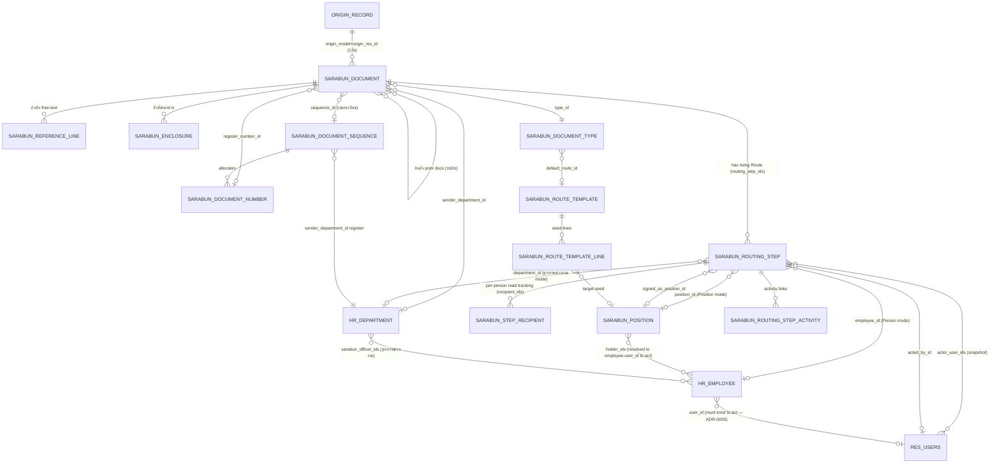
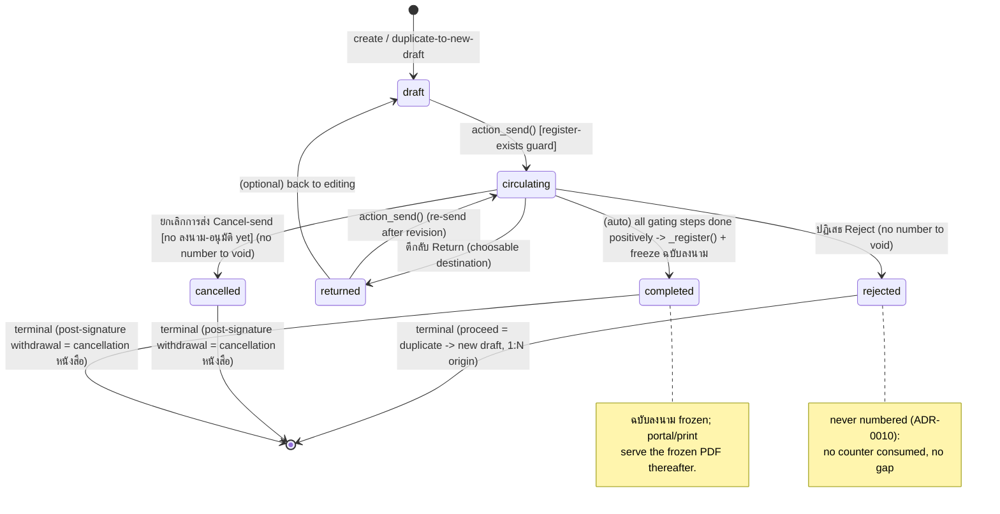
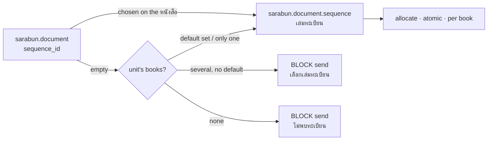
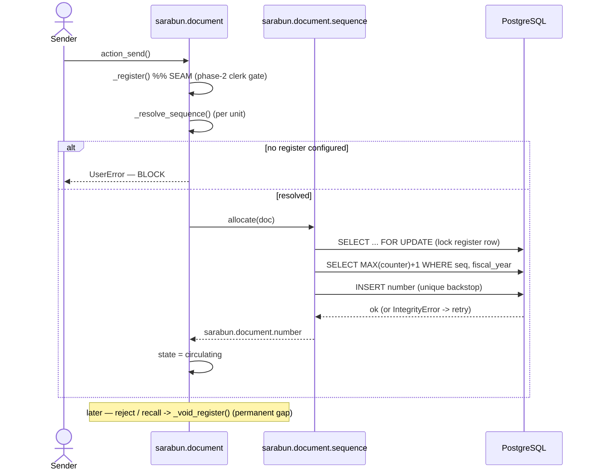
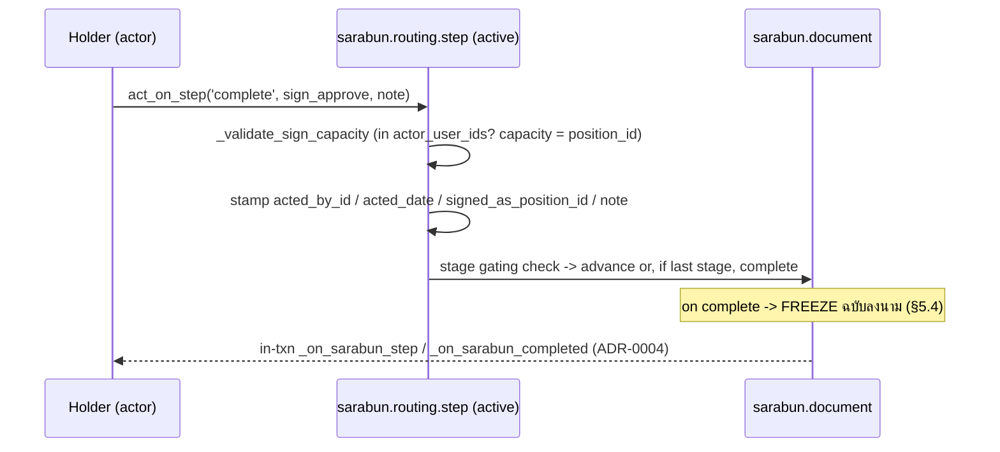
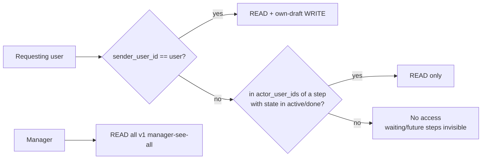

# agx_sarabun — Rebuild Design (v1)

This document is the consolidated technical design for the rebuilt `agx_sarabun`
module: a true **e-Saraban (สารบรรณอิเล็กทรอนิกส์)** system in which the
**หนังสือ (Document, `sarabun.document`)** is the protagonist — registered,
numbered per the records regulation, and routed through an embedded
approval/endorsement engine. Other modules attach only as **Origin records**
through a secondary adapter. v1 focuses on the `from_record` Document kind
(origin-driven e-flow).

It assembles eight section drafts into one coherent specification and applies a
cross-section consistency review so that every field name, method name, and
state/disposition vocabulary is identical throughout.

## Authoritative sources

The glossary and the four ADRs are the source of truth; where any detail here
conflicts with them, they win.

- Glossary of canonical terms — [`CONTEXT.md`](./CONTEXT.md)
- [ADR-0001 — Routing engine is a dynamic chain on a single step entity](./docs/adr/0001-routing-engine-dynamic-chain.md)
- [ADR-0002 — Document lifecycle and negative paths](./docs/adr/0002-document-lifecycle-negative-paths.md)
- [ADR-0003 — Position is a purpose-built catalog, not hr.job](./docs/adr/0003-position-catalog-not-hr-job.md)
- [ADR-0004 — Integration adapter: hardened callback-push, atomic, 1:N](./docs/adr/0004-integration-adapter-contract.md)
- [ADR-0005 — Routing targets are hr.employee, resolved to employee.user_id to act (refines ADR-0003)](./docs/adr/0005-routing-targets-are-personnel.md)

## Canonical names (resolved across all sections)

To remove the drift the section drafts carried, the following names are
**fixed** and used identically everywhere in this document. All code blocks,
tables, and prose below conform to them.

| Concept | Canonical name | Type / comodel |
|---|---|---|
| Document → live Route (O2m) | `routing_step_ids` | O2m → `sarabun.routing.step` |
| Stage grouping integer on a step | `order` | Integer |
| Resolved holder snapshot on a step | `actor_user_ids` | M2m → `res.users` |
| Who actually acted | `acted_by_id` | M2o → `res.users` |
| When acted | `acted_date` | Datetime |
| Capacity signed in | `signed_as_position_id` | M2o → `sarabun.position` |
| เกษียน note on a step | `note` | Text |
| Step lifecycle | `state` | Selection `waiting`/`active`/`done`/`skipped` |
| How the actor responded | `disposition` | Selection `complete`/`direct`/`delegate`/`return`/`reject` |
| Step target (canonical) | `position_id` / `employee_id` / `department_id` | per `target_mode` (person target is `hr.employee`, resolved to `employee.user_id` to act — ADR-0005) |
| Document concrete type | `type_id` | M2o → `sarabun.document.type` |
| Frozen signed PDF | `signed_pdf` | Binary (`attachment=True`) |
| Official number | `name` | Char (related from `register_number_id`) |
| Register ledger row | `register_number_id` | M2o → `sarabun.document.number` |
| Sender issuing ส่วนงาน | `sender_department_id` | M2o → `hr.department` |
| Stage-advance check | `_stage_complete(order)` / `_advance_stage()` | methods on `sarabun.document` |

Two resolutions worth calling out, because the drafts disagreed:

- **Reject/Return are dispositions, not step states.** A step that was returned
  or rejected ends `state == 'done'` with `disposition in ('return', 'reject')`.
  The document-level `returned`/`rejected` states carry the negative path; the
  per-step `returned`/`rejected` *state* values from one draft are dropped.
- **A circulating callback fires at send.** `_on_sarabun_circulating(document)`
  is a first-class adapter callback fired at `draft → circulating`. The lifecycle
  "Send" transition explicitly fires it (the earlier "no callback at send" wording
  is corrected).

---

## Table of contents

1. [Data Model & Entities](#1-data-model--entities)
2. [Routing Engine: Steps, Stages, Verbs, Dispositions](#2-routing-engine-steps-stages-verbs-dispositions)
3. [Document Lifecycle & State Machine](#3-document-lifecycle--state-machine)
4. [Numbering & Register](#4-numbering--register)
5. [Signing, Freeze & Cover Sheet](#5-signing-freeze--cover-sheet)
6. [Security & Access](#6-security--access)
7. [Notifications & Inbox](#7-notifications--inbox)
8. [Integration Adapter (Origin Records)](#8-integration-adapter-origin-records)
9. [Old → New mapping (summary)](#9-old--new-mapping-summary)
10. [Assumptions to validate](#10-assumptions-to-validate)

---

## 1. Data Model & Entities

This section defines every model in the rebuilt `agx_sarabun`, its key fields and
relations, the entity-relationship overview, and an explicit OLD→NEW migration
map (consolidated in §9). The **หนังสือ (Document, `sarabun.document`)** is the
protagonist; the **Route** is living data on it, modelled as a single unified
**Routing Step (`sarabun.routing.step`)** entity.

### 1.1 ER overview



ASCII summary of the core triangle (the part ADR-0001 most reshapes):

```
                 sarabun.document  (the หนังสือ — protagonist)
                        │ 1
                        │ document_id
                        ▼ N
            ┌──────────────────────────────────────┐
            │      sarabun.routing.step             │   ← ONE unified entity
            │  (target + verb + state + disposition)│     (was routing.line + recipient)
            └──────────────────────────────────────┘
              target mode = position | person | unit (ธุรการหน่วยงาน)
                position_id → sarabun.position ──holder_ids──> hr.employee ──user_id──> res.users
                                  (each holder resolved to employee.user_id, then SNAPSHOTTED
                                   into actor_user_ids on activation — ADR-0005; a holder with
                                   no linked user can be configured but can never act)
```

### 1.2 `sarabun.document` — the หนังสือ (protagonist)

The single official-correspondence item: registered, numbered, and routed.
Inherits `mail.thread`, `mail.activity.mixin`, `portal.mixin`, `thai.date.mixin`.

| Field | Type | Notes |
|---|---|---|
| `name` | Char (readonly, default `/`) | Official registered number, rendered in พ.ศ. Set from `register_number_id.register_number`; assigned **at completion** (final ลงนาม/อนุมัติ — ADR-0010), stays `/` while draft/circulating. |
| `kind` | Selection (related, stored) | Dev-extensible behaviour axis: `memo`/`circular`/`from_record`. Mirrored from `type_id.kind`. v1 emphasis = `from_record`. |
| `type_id` | M2o → `sarabun.document.type` (required) | Admin-configurable concrete type; binds sequence/default-route/template. |
| `subject` | Text (required) | **เรื่อง** — the document's title. Multi-line free text. |
| `addressee_prefix_id` | M2o → `sarabun.addressee.prefix` | **คำขึ้นต้น (salutation)** — configurable master data opening the `addressee` line; seeded "เรียน" (กราบทูล / เสนอ / ยื่นต่อ … configurable). No hardcoded "เรียน" label. |
| `addressee` | Text (multiline) | **เรียน (Addressee)** — own header field, manual or origin-set, opened by `addressee_prefix_id`. Replaces old free-text `recipient`/"To". |
| `content` | Html (sanitized) | **เนื้อหา (body)** — free rich text. The letter body for composed memo/circular; an optional covering note above the origin report for `from_record`. Editable while `draft`/`returned`; rendered on the cover sheet. Full regulation memo layout is phase-2. |
| `remark` | Html (sanitized) | **หมายเหตุ (Remark)** — an optional **internal** note captured after `content`. Working notes only — **not** part of the letter body and not rendered as official content. |
| `sender_user_id` | M2o → `res.users` (readonly) | The composer. |
| `sender_department_id` | M2o → `hr.department` (required) | **sender ส่วนงาน** — owns the เล่มทะเบียน the หนังสือ may issue from (ADR-0012). |
| `sender_suffix` | Char | Sub-unit / extension display. |
| `state` | Selection (readonly, tracked) | `draft → circulating → completed`; negative `returned`/`rejected`/`cancelled` (see §3). Replaces old `sent`. |
| `strongest_verb_id` | M2o → `sarabun.verb` (computed/stored) | Highest-`rank` verb positively completed so far (`False` = none). Drives Recall eligibility (ADR-0002: Recall only if no signature verb — `verb.is_signature` — has completed yet). |
| `origin_model` | Char (indexed) | Origin link — owned by the document (ADR-0004). |
| `origin_res_id` | Integer (indexed) | Origin record id. The `(model,res_id)` pair is the **1:N** link origin → documents. |
| `route_template_id` | M2o → `sarabun.route.template` | The template that **seeded** the steps. Not authoritative once seeded (ADR-0001). |
| `routing_step_ids` | O2m → `sarabun.routing.step` | The living Route (current attempt). |
| `archived_step_ids` | O2m → `sarabun.routing.step` (domain `active=False`, `active_test=False`) | Frozen steps of closed attempts, kept for audit (see §3). **Not shown on the form** — ดึงกลับ / ตีกลับ / รีเซ็ต all re-run the whole เส้นทาง, so the prior attempt is noise beside the live Route. |
| `attempt_seq` | Integer | Generation counter bumped on each re-send; stamps steps so prior attempts survive as history (see §3). |
| `reference_document_ids` | M2m → `sarabun.document` | **อ้างถึง** prior in-system หนังสือ. |
| `reference_line_ids` | O2m → `sarabun.reference.line` | **อ้างถึง** free-text out-of-system letters. |
| `enclosure_ids` | O2m → `sarabun.enclosure` | **สิ่งที่ส่งมาด้วย**, ordered. |
| `sequence_id` | M2o → `sarabun.document.sequence` (computed, stored, editable) | **เล่มทะเบียน** this หนังสือ issues from (ADR-0012). Defaults to the unit's เล่มทะเบียนหลัก / only book; editable while draft/returned; **pinned at send**. |
| `register_number_id` | M2o → `sarabun.document.number` | The register ledger row; set by `_register()` at completion (ADR-0010). |
| `numbering_mode` | Selection `auto`(default)/`reserved` | Constrained to `auto` for `from_record` (see §4). |
| `signed_pdf` | Binary (`attachment=True`) | **ฉบับลงนาม** — frozen immutable PDF at `completed`. Before that, preview renders live. |
| `signed_pdf_filename` | Char | Render filename (reuses origin filename via `_get_report_base_filename`). |
| `signed_at` | Datetime | Freeze timestamp. |
| `company_id` | M2o → `res.company` (required) | |

Key derived/UI fields: `is_frozen` (computed `bool(signed_pdf)`), `current_step_ids`
(active steps the current user may act on — replaces `current_user_recipient_id`),
`pending_ack_count` ("ค้างรับทราบ N"), `routing_progress`, `access_url`,
`report_preview_url`, `has_cover_sheet` (true for `from_record`).

**Per-current-user inbox fields** (all `compute="_compute_my_inbox"`, non-stored,
read off `my_reaching_step_id` — the step that reached the user: their active step,
or once they have acted, their most recent completed step, so the columns stay
populated in the persistent Incoming box — §1.8): `my_received_date`
(**วันที่ได้รับ** — the current user's own `sarabun.step.recipient.received_date`,
per-person; may be later than the step's activation under delegation), `my_action_verb_id`
(M2o → `sarabun.verb`, **เพื่อดำเนินการ** — what this user was asked to do),
`my_read_state` (Selection `unread`/`read`/`forwarded`, **สถานะการอ่าน** — whether
this user has opened the หนังสือ, tracked per person). (`my_active_step_id` stays
active-only — it drives the "Act on My Step" button.) `action_mark_read()` stamps
`read_date` on the current user's active-step `sarabun.step.recipient` rows; it is
called by the `sarabun_document_form` js_class controller when the form is genuinely
opened (not from `read()` — §7.1). Opening ("seen") is deliberately **separate** from
รับทราบ (a disposition completing a step).

Semantic helper fields (computed booleans, accessed as attributes — these
**replace** any method-call form, fixing the field-vs-method drift): `is_circulating`,
`is_completed`, `is_returned`, `is_rejected`, `is_cancelled`, `is_terminal`
(rejected or cancelled), `has_signed` (any positively-completed step whose `verb.is_signature`).

Key methods (design intent): `action_send()` (validate — incl. `_resolve_sequence()`
register-exists guard — → `state=circulating` → `_advance_stage()` activate first
Stage; does **not** number, ADR-0010), `action_recall()` (guarded by `not has_signed`),
`_complete_document()` (`_register()` → `_freeze_signed_copy()`), `_freeze_signed_copy()`
(merge cover sheet + origin body → `signed_pdf`), `_register()` (atomic allocate at
completion, see §4), `_stage_complete(order)` / `_advance_stage()` (Stage gating logic),
`_void_register(reason)` (guarded no-op on the normal path since ADR-0010).

### 1.3 `sarabun.routing.step` — the unified Route step (ADR-0001)

**One entity = target + verb + state + disposition.** Replaces the old
`routing.line` (plan) **and** `document.recipient` (tracker) split. Inherits
`mail.thread`.

| Field | Type | Notes |
|---|---|---|
| `document_id` | M2o → `sarabun.document` (required, cascade, indexed) | Owner. |
| `order` | Integer | **Stage** grouping: steps sharing one `order` run in parallel. Sequential = stages of one step each. |
| `verb_id` | M2o → `sarabun.verb` (required) | Configurable verb **record** (master data), not a hardcoded Selection. Built-ins: `รับทราบ` (non-gating), `เห็นชอบ` (gating), `ลงนาม-อนุมัติ` (gating + signature). Referenced in code by xmlid (`agx_sarabun.verb_acknowledge` / `verb_endorse` / `verb_sign_approve`), never by a string code (there is no code field). |
| `gating` | Boolean (computed, stored) | `verb_id.gating and not for_info`. The advancement gate — reads the verb's `gating` flag, no string branch. |
| `for_info` | Boolean | **สำเนาเรียน (CC)** flag on an `acknowledge` step. Never blocks advancement/completion. No separate entity. |
| `target_mode` | Selection (required) | `position` (canonical) / `person` / `unit`. Replaces old `recipient_type` `user/department/role`. |
| `position_id` | M2o → `sarabun.position` | Target when `target_mode=position`. |
| `employee_id` | M2o → `hr.employee` | Target when `target_mode=person` — the personnel record (renamed from the old `user_id`). Resolved to `employee.user_id` at activation to act (ADR-0005); an employee with no linked user can be configured but can never act. |
| `department_id` | M2o → `hr.department` | Target when `target_mode=unit` (the หน่วยงาน whose ธุรการหน่วยงาน clerks act — `hr.department.sarabun_officer_ids`, `hr.employee`). |
| `actor_user_ids` | M2m → `res.users` (readonly) | **Resolved holder-set snapshotted when the step becomes ACTIVE** (ADR-0003). Targets are personnel (`hr.employee`); each holder is resolved to `employee.user_id` and the resulting *user* set is snapshotted here — the engine still acts by user (ADR-0005). Multi-holder = first-to-act-wins. Org changes after activation never rewrite this. The field the security read-rule keys on. |
| `state` | Selection (tracked) | `waiting` (future/not reached) → `active` → `done` / `skipped`. |
| `disposition` | Selection | The move taken once done: `complete`/`direct`/`delegate`/`return`/`reject` (the 5 dispositions). |
| `acted_by_id` | M2o → `res.users` (readonly) | Who acted (one of the snapshot holders, or a delegatee). |
| `acted_date` | Datetime (readonly) | When acted. |
| `signed_as_position_id` | M2o → `sarabun.position` (readonly) | The **capacity** signed in — validated against `position_id` (or its acting capacity), per ADR-0003. Replaces old `signed_as_role_id`. |
| `note` | Text | **เกษียน** note — rendered onto the official document's เกษียน trail, not hidden in chatter. |
| `delegated_to_id` | M2o → `res.users` | Set by มอบหมาย (Delegate): X performs **this** step. |
| `created_by_disposition` | Selection (`seed`/`direct`/`delegate`/`return`) | Provenance: `seed` (from template), or inserted at runtime. |
| `inserted_by_step_id` | M2o → `sarabun.routing.step` | Self-ref for mid-flow insertion (เกษียนสั่งการ inserts the NEXT step). |
| `seeded_from_template_line_id` | M2o → `sarabun.route.template.line` | Provenance for audit; irrelevant once the step exists. |
| `active` | Boolean (default True) | Set `False` when a re-send freezes the attempt; archived steps survive as history. |
| `attempt_seq` | Integer | Generation marker (matches the document's `attempt_seq` at the time the step belonged to the live Route). |
| `act_token` | Char (indexed, nullable, groups-restricted) | Phase-2 magic-link seam; **never generated in v1**. |
| `activated_date` | Datetime (readonly) | **วันที่ได้รับ** — when the step became `active` (the moment its recipients received it). Stamped in `_activate()`. |
| `recipient_ids` | O2m → `sarabun.step.recipient` | Per-person read tracking — one row per snapshot holder, materialised on activation (§1.8). |

Key methods (token-ready API per CONTEXT Access): the single act-on-step entry
point `act_on_step(disposition, *, actor=None, token=None, payload=None)`;
`_snapshot_holders()` (Position/Unit → current holders at activation);
`_activate()` (snapshot + schedule `mail.activity` for all holders + bus push);
`_clear_activities()` (multi-holder: auto-clear all holders' activities on
first-to-act); `_check_act_authority(actor)`. Each disposition runs its origin
callback **in the same transaction** and rolls back on failure (ADR-0004).

**Disposition → effect map:**

| Disposition | Effect on this step | Effect on Route |
|---|---|---|
| complete | `state=done`, `disposition=complete`, record `acted_by_id`/`signed_as_position_id`/`acted_date`/`note` | Stage advances when all *gating* steps done positively |
| เกษียนสั่งการ Direct | `state=done`, `disposition=direct` | Inserts NEXT step(s) at runtime |
| มอบหมาย Delegate | reassigns THIS step (`delegated_to_id`, re-snapshot), stays `active`, records `disposition=delegate` | unchanged |
| ตีกลับ Return | `state=done`, `disposition=return` | Document → `returned`; destination chosen (sender+restart default, or resume from a picked step) |
| ปฏิเสธ Reject | `state=done`, `disposition=reject` | Document → `rejected` (terminal); one reject in a co-approval Stage rejects whole doc; other steps → `skipped` |

### 1.4 `sarabun.routing.step.activity` — step ↔ activity link

A small helper model (`step_id`, `activity_id`, `user_id`) that ties each
scheduled `mail.activity` to the step and holder it was raised for, so clearing
on first-to-act is exact even with several active steps on one Document. Used by
Notifications (§7); listed here so the model inventory is complete.

### 1.5 `sarabun.position` — ตำแหน่งบริหาร catalog (ADR-0003)

Purpose-built administrative/authority position catalog. The **canonical routing
target** and the **signing capacity**. NOT `hr.job`, NOT academic rank.

| Field | Type | Notes |
|---|---|---|
| `name` | Char (required, translate) | e.g. คณบดี, ผอ.กอง, อธิการบดี. |
| `code` | Char (unique) | Short code. |
| `active` | Boolean | |
| `sequence` | Integer | Display ordering. |
| `department_id` | M2o → `hr.department` | Optional scope (the unit this post belongs to). |
| `holder_ids` | M2m → `hr.employee` | **Current holder(s)** of the post — personnel, not users (ADR-0005). At activation each holder is resolved to `employee.user_id` and that *user* set is snapshotted onto the step; a holder with no linked user can be configured but can never act. Multi-holder → first-to-act-wins. รักษาการ/มอบอำนาจ interim = add the acting person as a temporary holder. |
| `parent_id` | M2o → `sarabun.position` | Optional hierarchy (org display / future acting chains). |

Phase-2 acting seam (designed, not built in v1): an `acting_assignment` relation
(delegate user + capacity + validity window) feeding holder resolution. Academic
rank stays on the person (`hr.employee.academic_standing_title`) for the
**signature block display only** — never modelled here.

Key method: `_current_holder_users(at_datetime=None)` → recordset of `res.users`
(resolves `holder_ids` (`hr.employee`) to their linked `user_id`, dropping any
holder with no linked user — ADR-0005). A companion `_current_holder_employees()`
returns the raw `hr.employee` holders.

### 1.6 `sarabun.document.type` + the `kind` axis (Classification)

A **fixed dev-extensible `kind`** (behaviour key) is split from
**admin-configurable type RECORDS** (concrete named types). The old code wrongly
used a hardcoded Selection `code` as both behaviour key *and* identifier.

| Field | Type | Notes |
|---|---|---|
| `name` | Char (required, translate) | Concrete type name, e.g. "บันทึกข้อความกองคลัง". |
| `kind` | Selection (required) | The fixed axis: `memo`/`circular`/`from_record` (phase-2: `external`/`order`/`announcement`). Drives report template, numbering, routing rules. |
| ~~`sequence_id`~~ | — | **Dropped.** The type does not bind a register: the เล่มทะเบียน is chosen on the หนังสือ / defaulted by the unit (ADR-0012). |
| `default_route_id` | M2o → `sarabun.route.template` | Seed template. |
| `report_template_id` | M2o → `ir.actions.report` | Compose/cover-sheet template for this type. |
| `active`, `sequence` | Boolean/Integer | |

The `kind` axis is a module-level constant list (extensible by dependent modules),
surfaced read-only on the document as `kind`.

### 1.7 `sarabun.document.sequence` + `sarabun.document.number` — the Register

Atomic, per-ส่วนงาน, fiscal-year-reset register (full behaviour in §4). Field
tables are given in §4.8 to avoid duplication. Key shape:

- **`sarabun.document.sequence`** — a **เล่มทะเบียน** owned by a `sender_department_id`
  (a unit may own several — ADR-0012; the หนังสือ picks one via `sequence_id`);
  `reset_period` default `fiscal_year` (also `yearly`/`never`); `allocate(document)`
  acquires a row lock, computes the next counter, writes the number row, and retries
  on the `unique(sequence_id, counter, fiscal_year)` backstop.
- **`sarabun.document.number`** — the audit ledger; `state` `reserved`/`used`/`voided`.
  `voided` (replacing the old `cancelled`) keeps the permanent **เลขยกเลิก** gap;
  the old `action_release` is **dropped** — numbers are never recycled.

### 1.8 `sarabun.step.recipient` — per-person read tracking

There is **no separate `sarabun.inbox` model**. The inbox is **two filtered views** of
`sarabun.document` (§7.3): the backend **Incoming box** (every หนังสือ that reached the
user — persistent, kept after they act and after the route finishes) and the systray
**Action tray** (only those still awaiting their action — transient). Per-person read
state lives on **`sarabun.step.recipient`** — one row per (routing step × resolved holder).
Even a ธุรการหน่วยงาน / ตำแหน่ง with several holders keeps a **separate row per
person**, so read status is individual. Rows are materialised (snapshot) when a step
activates. The old **`read()`-override anti-pattern** is **removed** (§7); "action
required" is driven by native `mail.activity` on the active step's snapshot holders.

| Field | Type | Notes |
|---|---|---|
| `step_id` | M2o → `sarabun.routing.step` (required, cascade, indexed) | Owner step. |
| `document_id` | M2o → `sarabun.document` (related `step_id.document_id`, stored, indexed) | |
| `user_id` | M2o → `res.users` (required, indexed) | The resolved holder. `unique(step_id, user_id)`. |
| `employee_id` | M2o → `hr.employee` (computed `user_id.employee_id`, stored) | **บุคลากร** — the person behind the user (ADR-0005). |
| `received_date` | Datetime (readonly) | **วันที่ได้รับ** — set when the row is created (step activation). |
| `read_date` | Datetime (readonly) | **วันที่เปิดอ่าน** — stamped by `document.action_mark_read()` when this user first opens the form. |
| `forwarded` | Boolean | **รอการส่งต่อ** — phase-2 seam, never set in v1. |
| `read_state` | Selection (computed, stored) | **สถานะการอ่าน** — `unread` (`รอการเปิดอ่าน`) / `read` (`เปิดอ่านแล้ว`) / `forwarded`, derived from `read_date`/`forwarded`. |

Population happens explicitly in `sarabun.routing.step._activate()` →
`_sync_recipients(users)`: idempotently create one row per snapshot holder (via
`sudo()`, since recipients are engine-owned and users have read-only access). Realtime
tray refresh is pushed by the step's `_notify_inbox()` over
`bus.bus._sendmany(... 'sarabun_inbox/updated')` — not inside `read()`. Note: **opened
≠ รับทราบ** — read/unread is a per-item attribute, independent of the "awaiting my
action" inbox membership.

### 1.9 References & enclosures

**อ้างถึง (Reference)** — split across two homes on `sarabun.document`:
`reference_document_ids` (M2m → `sarabun.document`, prior in-system หนังสือ) and
`reference_line_ids` (O2m → **`sarabun.reference.line`**, free-text out-of-system).

**`sarabun.reference.line`**: `document_id` (required, cascade), `sequence`
(display order), `text` (required, e.g. "หนังสือ อว 6801/123 ลว 1 พ.ค.").

**สิ่งที่ส่งมาด้วย (Enclosure) — `sarabun.enclosure`** (ordered, described;
rendered as numbered list "สิ่งที่ส่งมาด้วย ๑. …"): `document_id` (required,
cascade), `sequence` (the numbered-list index), `description` (required caption),
`attachment_id` (M2o → `ir.attachment`, optional).

The old `sarabun.reference` (hardcoded PR/PO/budget Selection) is **dropped** —
that was *related ERP records*, redundant with the origin link.

### 1.10 Route template (seed only)

A reusable preset that **only seeds** a Route's steps at send time (ADR-0001).

**`sarabun.route.template`**: `name`, `active`, `sequence` (match priority),
scope fields `department_id` / `document_type_id` / `origin_model`,
`condition_domain` (eval against origin), `line_ids` O2m.

**`sarabun.route.template.line`** (seeds one `routing.step`):

| Field | Maps to seeded step field |
|---|---|
| `template_id` (required, cascade) | — |
| `order` (Integer) | `order` (Stage) |
| `verb_id` (M2o → `sarabun.verb`) | `verb_id` |
| `for_info` (Boolean) | `for_info` |
| `target_mode` (`position`/`person`/`unit`) | `target_mode` |
| `position_id` / `employee_id` (`hr.employee`) / `department_id` | corresponding target field |

Seeded steps are inert until activation — pre-seeded named persons grant **no
visibility** until the step reaches them (CONTEXT Route visibility).

### 1.11 Mixin — `sarabun.document.mixin`

Owns the origin↔document relation (1:N). Exposes `sarabun_document_ids` (all,
computed search-based pseudo-O2m) + `active_sarabun_document_id` (current live).
Callbacks `_on_sarabun_circulating` / `_on_sarabun_completed` / `_rejected` /
`_returned` / `_cancelled` + generic `_on_sarabun_step(step, disposition)` receive
a **`sarabun.routing.step`** and run in the actor's transaction. Full contract in §8.

**Status reflection onto the origin.** The mixin also mirrors the current live
หนังสือ's status back onto the origin record so users on the source form can see
where the document is (all computed by `_compute_sarabun_documents`):
`sarabun_state` (Selection mirroring the document `state`), `sarabun_is_draft`
(Boolean — a หนังสือ exists but is still `draft`, not yet sent), and
`sarabun_state_label` (Char — human-readable `state` + routing progress, from
`sarabun.document._status_label()`). Consumer forms surface these as a **draft
warning** banner (`sarabun_is_draft`) and a **routing-progress** banner
(`sarabun_has_live_document and not sarabun_is_draft`, showing `sarabun_state_label`).

---

## 2. Routing Engine: Steps, Stages, Verbs, Dispositions

The routing engine is the emphasised heart of e-Saraban. Per **ADR-0001**, the
**Route** is *living, mutable data on the Document* — a chain of **Routing Steps**
(`sarabun.routing.step`) — not a frozen copy of a template. A **Route Template**
only *seeds* steps at send time. Authorised actors mutate the Route at runtime
(เกษียนสั่งการ insert, มอบหมาย reassign, ตีกลับ return, สำเนาเรียน CC). This
single-entity model replaces the old `routing.line` (immutable plan) +
`document.recipient` (one-at-a-time tracker) split that drifted out of sync.

### 2.1 The single step entity

A **Routing Step** = *target* (who acts) + *verb* (what they must do) + *state* +
*disposition*/outcome (who acted, when, the เกษียน note, the capacity signed in).
One row carries the whole life of one hop. (Full field table: §1.3.)

There is no separate plan/tracker pair: a step *is* both the plan and the live
tracker, which is what makes mid-flow insertion trivial and removes the sync bugs.

### 2.2 Seeding from a template

At **send** (`action_send`), `_seed_route_from_template()` materialises each
template line into a `sarabun.routing.step` with `state = 'waiting'`, copying
`order`, `target_mode`, the target reference, `verb`, and `for_info`. If a Document
Type binds a default route (`type_id.default_route_id`) it is used; otherwise the
sender composes steps directly. After seeding, the template is irrelevant —
subsequent edits to the template never touch a live Route.

### 2.3 Verbs

Verbs are **configurable master data** — model `sarabun.verb` with fields
`name` / `sequence` / `active` / `rank` / `gating` / `is_signature` (there is
**no `code` field**). Admins can add verbs; the engine never branches on a verb
string, only on the **flags** (`gating`, `is_signature`, `rank`). The three
built-ins below are seeded `noupdate` and referenced in code by **xmlid**
(`agx_sarabun.verb_acknowledge` / `verb_endorse` / `verb_sign_approve`):

| Built-in (xmlid) | Thai | Flags | Effect on completion |
|---|---|---|---|
| `verb_acknowledge` | รับทราบ | `gating=False` | Receipt confirmation only. Parallel-capable. Never blocks stage advancement or completion; tracked as "ค้างรับทราบ N". CC/สำเนาเรียน is this verb + `for_info`. |
| `verb_endorse` | เห็นชอบ | `gating=True` | Mid-chain gatekeeping; passes upward with an opinion. May also ตีกลับ / ปฏิเสธ. |
| `verb_sign_approve` | ลงนาม-อนุมัติ | `gating=True`, `is_signature=True`, highest `rank` | The authority's decision **and** signature, in the capacity of the step's `position_id`. Sign and approve are one verb for now. Completing one (`is_signature`) gates the Recall window (ADR-0002). |

> The verb **behaviour model is provisional** — the flags (`gating` /
> `is_signature` / `rank`) are the current contract; a candidate future is to
> derive completion/ranking from route order instead.

### 2.4 Dispositions

Five moves available at an `active` step, subject to authority. Each funnels
through the token-ready `act_on_step(disposition, payload)` API (§2.8).

| Disposition | Thai | What it does to the step | What it does to stage / document |
|---|---|---|---|
| **complete** | — | Performs the step's required verb. `state='done'`, `disposition='complete'`, stamps `acted_by_id`/`signed_as_position_id`/`acted_date`/`note`. First-to-act wins for multi-holder. | Re-evaluates the stage; if all gating steps `done` positively, advance. Fires `_on_sarabun_step(step, 'complete')`. |
| **เกษียนสั่งการ** | Direct | Like complete (`state='done'`, `disposition='direct'`), **then inserts a NEW next step**. | Inserts a step at `order = current + 1` (shifting later stages if needed); that step activates per normal advancement. Common path, not an exception. |
| **มอบหมาย** | Delegate | The actor will **not** act. Re-targets **THIS** step to X, re-resolves and re-snapshots `actor_user_ids`, keeps `state='active'`, `disposition='delegate'`. | No stage change. Stage stays open until X completes. |
| **ตีกลับ** | Return | `state='done'`, `disposition='return'`. | Document → `returned`. Destination **choosable**: default = back to sender, chain **restarted**; or **resume from a picked earlier step**. Prior steps kept as history. Fires `_on_sarabun_returned`. |
| **ปฏิเสธ** | Reject | `state='done'`, `disposition='reject'`. | **Terminal**: Document → `rejected`; other `active`/`waiting` steps → `skipped`. One reject in a co-approval stage rejects the whole Document. Registered number **voided**. To proceed, duplicate to a new draft. Fires `_on_sarabun_rejected`. |

> **Delegate ≠ Direct** (CONTEXT explicitly): มอบหมาย reassigns *this* step;
> เกษียนสั่งการ completes this step and inserts the *next*.

#### เกษียนสั่งการ (Direct) — insert next step

```python
def action_direct(self, target_vals, note):
    self._complete_current(note, disposition="direct")   # this step -> done
    insert_order = self.order + 1
    self._shift_stages_from(insert_order)                 # make room
    new_step = self.env["sarabun.routing.step"].create({
        "document_id": self.document_id.id,
        "order": insert_order,
        "inserted_by_step_id": self.id,
        "created_by_disposition": "direct",
        "state": "waiting",
        **target_vals,                                    # target_mode + target + verb
    })
    self.document_id._advance_stage()                     # may activate insert_order
    return new_step
```

#### มอบหมาย (Delegate) — reassign this step

```python
def action_delegate(self, new_target_vals, note):
    self.write({
        "disposition": "delegate",
        "note": (self.note or "") + note,
        **new_target_vals,                                # re-target THIS step
    })
    self._snapshot_holders()                              # re-resolve + re-snapshot
    self._activate()                                      # re-notify; state stays 'active'
```

### 2.5 Stage advancement rule

A **Stage** = all steps with the same `order` value, run in **parallel**. The
Route advances when **every gating step in the current stage is positively
complete** — and a stage with **no gating steps** is complete for advancement
once activated:

```python
def _stage_complete(self, order):
    steps = self.routing_step_ids.filtered(lambda s: s.order == order)
    gating = steps.filtered("gating")
    if not gating:
        return True                                       # pure รับทราบ stage never stalls
    return all(s.state == "done" and s.disposition in ("complete", "direct")
               for s in gating)
```

- **รับทราบ / `for_info` steps never gate.** Pending ones are surfaced as
  "ค้างรับทราบ N" but never block advancement or completion.
- `_advance_stage()` flips the next stage's `waiting` steps to `active`,
  **resolves + snapshots holders**, and raises a `mail.activity` on each holder.
  When no gating step remains anywhere downstream, `_complete_document()` sets
  `state='completed'` and freezes the ฉบับลงนาม.

### 2.6 First-to-act quorum

When a step targets a Position or Unit held by several people, `actor_user_ids`
holds all of them and the **first holder to act completes it** for the group. On
`act_on_step`, sibling holders' `mail.activity` records are auto-cleared. "Everyone
must act" is modelled as **several parallel steps in one stage**, never as a quorum
rule on a single step. A single ปฏิเสธ in a co-approval stage rejects the whole
Document.

### 2.7 Position / Unit resolution + holder snapshot

Resolution happens **at activation**, not at seed time (ADR-0003):

```python
def _snapshot_holders(self):
    # All three modes resolve to hr.employee holders, then to their linked
    # users; a holder with no user_id is dropped and can never act (ADR-0005).
    if self.target_mode == "position":
        employees = self.position_id.holder_ids                 # sarabun.position (hr.employee)
    elif self.target_mode == "unit":
        employees = self.department_id.sarabun_officer_ids      # ธุรการหน่วยงาน clerks (hr.employee)
    else:                                                       # person
        employees = self.employee_id                           # hr.employee
    holders = employees.mapped("user_id")                       # resolve to res.users
    self.actor_user_ids = [(6, 0, holders.ids)]
```

Targets are personnel (`hr.employee`); each holder is resolved to its
`employee.user_id` and the resulting *user*-set is **snapshotted** into
`actor_user_ids` so later org changes never rewrite history (ADR-0005 — the engine
still acts by user). A holder with no linked user is dropped at resolution and can
never act. รักษาการ/มอบอำนาจ (acting) is a phase-2 seam.
**Route visibility** derives from snapshots: a Document is readable by the sender
+ the snapshot actors of any `active`/`done` step. `waiting`/future steps grant
**no** visibility even if pre-seeded — fixing the old bug where Position/ธุรการหน่วยงาน
recipients with no `user_id` could not see the document.

### 2.8 Methods / flow

| Method | On | Purpose |
|---|---|---|
| `action_send()` | `sarabun.document` | draft → circulating. Seeds the Route, **verifies** a register resolves for (sender ส่วนงาน) — else **block with a clear error** — but does **not** number (ADR-0010: `_register()` runs at completion), activates stage 1 (resolve+snapshot+notify). Fires `_on_sarabun_circulating`. |
| `_seed_route_from_template()` | `sarabun.document` | Materialise template lines into `waiting` steps. |
| `_advance_stage()` | `sarabun.document` | If current stage complete, activate next stage or complete the Document. |
| `act_on_step(disposition, payload, *, actor=None, token=None)` | `sarabun.routing.step` | **Single token-ready entry point** for all 5 dispositions. Validates the caller is a current holder of an `active` step (or a valid magic-link token in phase-2), dispatches to the disposition handler, fires the origin callback **in the same transaction** (a failing callback rolls the action back — ADR-0004), then `_advance_stage()`. |
| `_activate()` / `_clear_activities()` | `sarabun.routing.step` | Native `mail.activity` on holders; clear on first-to-act. |

Origin callbacks pass a **`sarabun.routing.step`** (not the old recipient).

### 2.9 Sequence diagram — typical `from_record` approval

Route: clerk **เห็นชอบ** → หัวหน้างาน **เห็นชอบ** → ผอ.กอง **ลงนาม-อนุมัติ** →
เวียนเพื่อทราบ (parallel รับทราบ + สำเนาเรียน).

```mermaid
sequenceDiagram
    actor Sender as Origin/Sender
    participant Doc as sarabun.document
    participant S1 as Step order1 เห็นชอบ (clerk)
    participant S2 as Step order2 เห็นชอบ (หัวหน้างาน Position)
    participant S3 as Step order3 ลงนาม-อนุมัติ (ผอ.กอง Position)
    participant S4 as Stage4 รับทราบ + สำเนาเรียน (for_info)
    participant Origin as origin callback

    Sender->>Doc: action_send()
    Doc->>Doc: _seed_route_from_template() (4 stages, waiting)
    Doc->>Doc: _resolve_sequence() (register-exists guard) -> state=circulating
    Doc->>Origin: _on_sarabun_circulating(document) (same txn)
    Doc->>S1: _advance_stage() activates stage1: snapshot holder, mail.activity
    Note over S1: clerk acts -> complete (เห็นชอบ)
    S1->>Doc: act_on_step('complete'): S1 done
    Doc->>Origin: _on_sarabun_step(S1,'complete') (same txn)
    Doc->>Doc: stage1 gating done -> _advance_stage()
    Doc->>S2: activate stage2: resolve หัวหน้างาน Position -> snapshot (first-to-act)
    Note over S2: หัวหน้า acts -> complete
    S2->>Doc: act_on_step('complete'): S2 done; clear sibling activities
    Doc->>Doc: _advance_stage()
    Doc->>S3: activate stage3: resolve ผอ.กอง Position -> snapshot
    Note over S3: ผอ.กอง signs -> complete (ลงนาม-อนุมัติ)
    S3->>Doc: act_on_step('complete'): sign_approve recorded (Recall now closed)
    Doc->>Origin: _on_sarabun_step(S3,'complete')
    Doc->>Doc: _advance_stage()
    Doc->>S4: activate stage4: รับทราบ + for_info CC (non-gating, parallel)
    Doc->>Doc: no gating steps remain -> _complete_document()
    Doc->>Doc: state=completed; freeze ฉบับลงนาม (cover sheet + body PDF)
    Doc->>Origin: _on_sarabun_completed()
    Note over S4: pending รับทราบ tracked "ค้างรับทราบ N" — never blocked completion
```

At any active gating step the actor may instead **เกษียนสั่งการ**, **มอบหมาย**,
**ตีกลับ** (→ returned), or **ปฏิเสธ** (→ rejected; never numbered — ADR-0010).

### 2.10 OLD mechanisms removed

| Removed | Why / replacement |
|---|---|
| **Lazy `_activate_next_recipient`** (one-recipient-at-a-time creation on `state=='sent'`, creating `document.recipient` from `routing_line_ids`) | Cannot express parallel stages, CC, or mid-flow insertion. Replaced by explicit **Stages** + `_advance_stage()` over a single step entity. |
| **The line ↔ recipient split** (`routing.line` plan + `document.recipient` tracker kept in sync) | Two tables drifted out of sync. Replaced by one `sarabun.routing.step`. |
| **"Approval must be last" constraint** (`ROUTING_TYPE_SEQUENCE`) | Static flow could not model เกษียนสั่งการ. Any stage may carry `sign_approve`; gating is per-stage. |
| **Broken forward wizard** (`sarabun_routing_wizard.py`) | Replaced by first-class **Direct** (`act_on_step('direct', …)`) and **Delegate** inside the engine. |
| **`recipient_type` "user/department/role"** + `sarabun.role` | Replaced by `target_mode` `position`/`person`/`unit` against `sarabun.position` (ADR-0003). |
| **`recipient_ids.user_id` visibility rule** | Replaced by snapshot-based **Route visibility**: sender + holders of `active`/`done` steps. |
| **read()-override notifications** | Replaced by native `mail.activity` on active-step holders + sarabun inbox/bus, with sibling auto-clear (§7). |

---

## 3. Document Lifecycle & State Machine

The หนังสือ is the protagonist, and its lifecycle is the spine everything else
hangs off. This section specifies the state machine, the events that move a
Document between states, the guards, and the side effects. It supersedes the old
`draft → sent → completed/cancelled` model (ADR-0002), which dead-ended rejected
documents in `sent` and blocked cancellation after send.

> **Numbering timing — [ADR-0010](./docs/adr/0010-register-number-at-completion-not-at-send.md):** ลงทะเบียน (`_register()`) runs at **completion** (final ลงนาม/อนุมัติ), not at send. So a `circulating` / `returned` หนังสือ carries **no number** (`name = "/"`), and the "VOID the number" side effects on ปฏิเสธ / ยกเลิกการส่ง below are guarded no-ops (there is no number to void — abandoned documents consume no counter). Send keeps only a register-*exists* guard.

### 3.1 States

The lifecycle lives in a single `state` field (`tracking=True`). The Route — the
living chain of `sarabun.routing.step` rows — runs *underneath* `circulating`;
document state and step state are distinct concerns, and the engine additionally
tracks `strongest_verb_id` because Recall depends on it (ADR-0002).

| `state` value | Thai term | Meaning | Terminal? | Revisable? |
|---|---|---|---|---|
| `draft` | ฉบับร่าง | Composed but not yet sent; no official number; freely editable. | no | yes |
| `circulating` | กำลังดำเนินการ | In flight along its Route (renamed from old `sent`). **No number yet** — assigned at completion (ADR-0010). | no | no (locked) |
| `completed` | เสร็จสิ้น | All gating steps positively completed; **number assigned** (ADR-0010); ฉบับลงนาม frozen. | yes (positive) | no |
| `returned` | ตีกลับ | Sent back for revision; revisable like a draft but the prior chain is kept as history. Still unnumbered. | no | yes |
| `rejected` | ปฏิเสธ | Terminal negative; never numbered (nothing to void — ADR-0010). Proceed by duplicating to a new draft. | yes (negative) | no |
| `cancelled` | ยกเลิก/เรียกคืน | Withdrawn via ยกเลิกการส่ง before any signature; never numbered (nothing to void — ADR-0010). | yes (negative) | no |

Supporting fields the machine reads/writes (all defined in §1.2): `state`,
`register_number_id`/`name`, `strongest_verb_id`, `routing_step_ids`,
`archived_step_ids` + `attempt_seq` (frozen prior chains), `signed_pdf` (the
frozen ฉบับลงนาม, set only at `completed`), `origin_model` + `origin_res_id`.
Number voiding is recorded on the ledger row (`register_number_id.state = 'voided'`
+ `void_reason`), not on a separate document flag — see §4.7.

### 3.2 State diagram



### 3.3 Transition table

Each transition is an action method on `sarabun.document` (or, for auto-advance,
triggered from the step-disposition handler on `sarabun.routing.step`). Guards
raise `UserError`/`ValidationError` with a clear message — **never** silently no-op.

| # | Event (method) | From | Guard | To | Side effects |
|---|---|---|---|---|---|
| 1 | **Send** `action_send()` | `draft`, `returned` | (a) Route has ≥1 gating step; (b) a register sequence **resolves** for *(sender ส่วนงาน)* — else block with clear error; (c) for `returned`-restart, chain already re-seeded (#4a). | `circulating` | `_resolve_sequence()` verifies the register exists but does **not** allocate (ADR-0010 — numbering is deferred to #2); `_advance_stage()` activates stage 1 (`active`, **snapshot** holders into `actor_user_ids`, fire `mail.activity`). **Fire `_on_sarabun_circulating(document)`** in the same transaction. Document becomes read-locked, still `name = "/"`. |
| 2 | **Complete** (auto) `_advance_stage()` → `_complete_document()` | `circulating` | Every *gating* step in the **current Stage** positively completed; รับทราบ/`for_info` never blocks; no further gating step remains downstream. | `completed` | `_register()`: allocate `name` atomically (row-lock + `unique(sequence,counter,fiscal_year)` backstop + retry; render พ.ศ., reset per ปีงบประมาณ) — the number runs **only now** (ADR-0010). Then freeze **ฉบับลงนาม** (`_freeze_signed_copy()`): render cover sheet + signature block + เกษียน trail, merge with origin report → immutable `signed_pdf`; portal/print now serve the frozen file. Recompute `strongest_verb_id`. Call `_on_sarabun_completed(document)` in the same transaction (failure rolls back — ADR-0004). Clear residual `mail.activity`. |
| 3 | **Direct / Delegate** `act_on_step(...)` | `circulating` (step-level) | Actor is a snapshot holder of an *active* step with authority. | `circulating` (no state change) | Direct inserts the NEXT step(s); Delegate reassigns THIS step. `note` recorded. Re-evaluate `_advance_stage()`. Generic `_on_sarabun_step(step, disposition)` in-transaction. Intra-`circulating` moves, not lifecycle transitions. |
| 4 | **Return** `action_return(destination)` | `circulating` | Actor is a snapshot holder of an *active* gating step with authority. `destination` ∈ {`sender_restart` (default), `resume_step`}. | `returned` | **Freeze the prior chain** (archive `routing_step_ids` into the attempt's frozen เกษียน trail — §3.4). Record returner, capacity, comment, destination. Still **unnumbered** (ADR-0010 — no number is assigned until completion). Re-seed/resume per destination (#4a/#4b). `_on_sarabun_returned(document, step)` in-transaction. Notify sender via `mail.activity`. |
| 4a | — *destination `sender_restart`* | — | — | `returned` | Re-seed a fresh Route from the template / `type_id.default_route_id` (steps `waiting`); sender revises then re-sends (#1) which re-activates Stage 1 from scratch. |
| 4b | — *destination `resume_step`* | — | — | `returned` | **Archive the whole current attempt** (`active=False`, bump `attempt_seq`); recreate the picked step (and later) as fresh `waiting` steps in the new attempt (via `_resume_seed_vals`) so the prior chain is kept as history, **never overwritten** (ADR-0006). On re-send the Route resumes at the picked step. |
| 5 | **Reject** `action_reject()` | `circulating` | Actor is a snapshot holder of an *active* gating step with authority. A single ปฏิเสธ in a co-approval Stage rejects the whole Document. | `rejected` (terminal) | No number to void — the หนังสือ was never numbered (ADR-0010); `_void_register('rejected')` is a guarded no-op. Other active/waiting steps → `skipped`. Freeze the chain. Record rejecter/capacity/comment. `_on_sarabun_rejected(document, step)` in-transaction. Proceed via `action_duplicate_to_draft()` → new `draft` linked to the SAME origin (1:N). |
| 6 | **ยกเลิกการส่ง / Cancel-send** `action_recall(reason)` | `circulating` | (a) sender (or manager); (b) **`not has_signed`**; (c) **reason required** (ADR-0006). If a signature exists → block, directing to a cancellation หนังสือ (#7). | `cancelled` (terminal) | No number to void (ADR-0010 — never numbered; `_void_register('cancelled')` is a no-op). Skip active/waiting steps; clear `mail.activity`. `_on_sarabun_cancelled(document)` in-transaction. |
| 6b | **ดึงกลับ / Recall** `action_pull_back(reason)` | `circulating` | Same guard as #6 (sender, `not has_signed`, **reason required**). | `returned` | Still **unnumbered** (ADR-0010 — nothing to keep). Archive the current chain (`active=False`, bump `attempt_seq`) and re-seed the template (restart) — a self-initiated ตีกลับ-to-sender (#4a). `_on_sarabun_recalled(document)` in-transaction; the mixin default delegates to `_on_sarabun_returned`. |
| 7 | **Post-signature cancellation** (no in-place transition) | `completed` (or `circulating` after a signature) | A ลงนาม-อนุมัติ step has occurred. | unchanged | NOT a transition. Compose a **new cancellation หนังสือ** (referencing the original via อ้างถึง). Original keeps its number and `completed` state for audit. |
| 8 | **Duplicate-to-new-draft** `action_duplicate_to_draft()` | `rejected` | — | new `draft` (NEW record) | Copies content into a fresh `draft`; links to the same origin (`origin_model`/`origin_res_id`), making it the new `active_sarabun_document_id`. The rejected original is untouched. |

### 3.4 Returned documents: history, restart vs resume

A Return must never silently discard work. On every Return (#4), Reject (#5) and
Recall (#6) the engine **freezes the current Route into the document's เกษียน
trail** rather than deleting it. Implementation: each *attempt* is a generation
marker (`attempt_seq` bumped on each re-send); the steps of a closed attempt are
archived (`active=False` + `attempt_seq` stamp) so they survive as immutable
history, while `routing_step_ids` shows only the current attempt's steps and
`archived_step_ids` exposes the rest **for audit** — the form deliberately does
not render it, since every backward move re-runs the whole เส้นทาง.

- **`sender_restart`** (default): the chain is **restarted** — a new attempt's
  steps are freshly seeded in `waiting`; on `action_send()` the Route re-activates
  from Stage 1.
- **`resume_step`**: the chain is **resumed** — steps before the picked step keep
  their completed outcomes; the picked step and everything after re-set to
  `waiting`; on re-send the Route resumes from the picked step.

In both cases the prior attempt's frozen steps remain queryable for the rendered
เกษียน trail and for Route visibility (snapshot actors of completed steps retain
read access).

### 3.5 Number voiding on reject / cancel

> **Superseded for the normal path by [ADR-0010](./docs/adr/0010-register-number-at-completion-not-at-send.md).** Because the number is now assigned at **completion**, a rejected (#5) or cancelled (#6) หนังสือ — both pre-completion — was **never numbered**, so there is nothing to void and no gap to record. `_void_register(reason)` is retained but is a **guarded no-op** on this path (kept for the reserved compose path). The paragraph below describes the *former* at-send behaviour and is kept for historical context.

Per ระเบียบงานสารบรรณ, an official register number is **never reusable**
(ADR-0002). When a *registered* Document (one that reached `circulating`) is
rejected (#5) or recalled (#6), `_void_register(reason)` sets the ledger row
`state='voided'` with `void_reason`/`void_date` (the row, number, and gap are
**retained**, surfaced as เลขยกเลิก — a permanent gap, never reissued). Atomic
allocation at send guarantees the gap is genuine. A `returned` Document **retains**
its number and re-uses it on re-send; voiding is reserved for terminal negatives.
A `draft` or never-registered Document has no number to void.

### 3.6 Notes on enforcement

- Guards live in the action methods and raise on violation — `action_send()`
  raises if no register sequence resolves; `action_recall()` raises once
  `has_signed`.
- Lifecycle callbacks and the generic `_on_sarabun_step(step, disposition)` run
  **in the same transaction** as the triggering action; a raising origin callback
  rolls the whole disposition back (ADR-0004).
- Auto-advance to `completed` (#2) and reject-by-one-vote in a co-approval Stage
  (#5) are driven from the step-disposition handler, keeping the document-state
  machine reactive to Route progress rather than duplicating gating logic.

---

## 4. Numbering & Register

> **Canonical term:** the official running number is assigned by the **ลงทะเบียน
> (Register)** event. Reserve the word *register* for this; never call it
> "numbering" generically. See CONTEXT.md › Numbering and ADR-0002 (voiding).

### 4.1 The Register event — a distinct seam, fired at completion (ADR-0010)

ลงทะเบียน fires **automatically at completion** (`circulating → completed`, when the
final ลงนาม/อนุมัติ is in — [ADR-0010](./docs/adr/0010-register-number-at-completion-not-at-send.md)),
but is kept a **distinct, named operation** so a phase-2 ธุรการหน่วยงาน clerk-gate can
be slotted in front of it without touching the lifecycle transition. **Send** no
longer numbers — it only *verifies* a register resolves (fail-fast), so the route
cannot reach its final signature only to strand there with nowhere to allocate.

```
action_send()                      # verifies a register resolves; does NOT number
  └─ _resolve_sequence()           # (sender ส่วนงาน); BLOCK on missing

_complete_document()               # sarabun.document : the → completed transition
  └─ _register()                   # the SEAM — phase-2 inserts a clerk gate here
       └─ sequence.allocate(doc)   # sarabun.document.sequence : atomic allocation
```

```python
# sarabun.document
def action_send(self):
    for doc in self:
        doc._guard_can_send()          # state in (draft, returned), route seeded, addressee, ...
        doc._resolve_sequence()        # register-EXISTS guard only (BLOCK on missing); no allocation
        doc.state = "circulating"      # CONTEXT: renamed from old "sent"; name still "/"
        doc._advance_stage()           # activate stage 1
        doc._dispatch_origin_callback(doc, "_on_sarabun_circulating", doc)

def _complete_document(self):
    self.state = "completed"
    self._register()                   # SEAM — the number runs only now
    self._freeze_signed_copy()         # frozen PDF carries the number
    ...

def _register(self):
    """The ลงทะเบียน event. Distinct seam; phase-2 clerk-gate lands here."""
    self.ensure_one()
    if self.register_number_id:        # idempotent (guards a double completion)
        return
    seq = self._resolve_sequence()     # (sender ส่วนงาน); BLOCK on missing
    self.register_number_id = seq.allocate(self)   # atomic
```

Idempotency: `_register()` is a no-op if `register_number_id` is already set, so a
`returned`-then-re-sent-then-completed Document is numbered once (at its single
completion). Because a number is issued only on the terminal-positive transition,
`rejected`/`cancelled` documents never hold one — the counter series is contiguous
over completed documents, and the former void-on-negative path (§3.5) no longer
fires (ADR-0010).

### 4.2 Sequence resolution — the เล่มทะเบียน the หนังสือ picks, BLOCK on missing/ambiguous

A ส่วนงาน owns **as many เล่มทะเบียน as it needs**
([ADR-0012](./docs/adr/0012-multiple-register-books-per-unit.md)); the หนังสือ says
which book it issues from (`sequence_id`), defaulting to the unit's
**เล่มทะเบียนหลัก** (`hr.department.default_sarabun_sequence_id`) — or, when the unit
owns exactly one book, to that book with no configuration at all. The old
`is_shared`/`department_ids` "leave empty = all departments" fallback stays
**dropped** — silent institute-wide numbering is the exact anti-pattern CONTEXT
forbids. No book at all, or several with no default ⇒ **block the send** with a
clear, actionable error (the old `ir.sequence` / `next_by_code` fallbacks are gone).

```python
# sarabun.document
def _resolve_sequence(self):
    self.ensure_one()
    seq = self.sequence_id or self.sender_department_id._sarabun_default_sequence()
    if not seq:
        unit = self.sender_department_id.display_name
        if self.sender_department_id._sarabun_registers():
            raise UserError(_(
                "ส่วนงาน '%s' มีหลายเล่มทะเบียน — โปรดเลือกเล่มทะเบียนที่จะใช้ส่ง."
            ) % unit)
        raise UserError(_("ไม่พบทะเบียนหนังสือสำหรับส่วนงาน '%s'.") % unit)
    return seq
```

`action_send()` **pins** the resolved book onto `sequence_id`: ลงทะเบียน runs at
completion (ADR-0010), so the pin keeps a mid-route config change from moving the
หนังสือ to another series between ส่ง and ลงทะเบียน.

The หนังสือ's **type** does *not* select a register — the drafter (or the unit's
default) does. Binding a sequence to `sarabun.document.type` would re-introduce the
per-`(ส่วนงาน × type)` coupling that was already removed; a unit that wants a book
per type simply leaves the default empty and picks per หนังสือ.



### 4.3 Atomic allocation — replacing the old max()+1 race

**The old bug (confirmed).** `get_next_and_use()` did two unsynchronised steps:
`_compute_next_number` computed `max(used_numbers) + 1` over an **in-memory
recordset** (`sarabun_document_sequence.py:119`), then `use_number()` created the
row in a *separate* ORM call. Two `action_send` transactions interleaving both read
the same `max` and pick the same number — a classic check-then-act race; the unique
constraint only caught it at commit as an opaque `IntegrityError` with no retry.

**The fix.** Allocation acquires a **row lock on the sequence record**
(`SELECT … FOR UPDATE`), computes the next counter under the lock, writes the
number row, keeps the **`unique(sequence_id, counter, fiscal_year)` constraint as a
backstop**, and a **bounded retry** for rare cross-process / manual-insert
collisions.

```python
# sarabun.document.sequence
def allocate(self, document, max_retries=3):
    """Atomically register the next official number. Replaces old max()+1 race."""
    self.ensure_one()
    fy = self._fiscal_year_for(fields.Date.context_today(self))   # §4.4
    for attempt in range(max_retries):
        try:
            with self.env.cr.savepoint():
                self.env.cr.execute(
                    "SELECT id FROM sarabun_document_sequence "
                    "WHERE id = %s FOR UPDATE", (self.id,),
                )
                self.env.cr.execute(
                    "SELECT COALESCE(MAX(counter), 0) + 1 "
                    "FROM sarabun_document_number "
                    "WHERE sequence_id = %s AND fiscal_year = %s",
                    (self.id, fy),
                )
                counter = self.env.cr.fetchone()[0]
                number = self.env["sarabun.document.number"].create({
                    "sequence_id": self.id,
                    "counter": counter,
                    "fiscal_year": fy,
                    "state": "used",
                    "document_id": document.id,
                    "used_date": fields.Datetime.now(),
                })
            return number
        except psycopg2.IntegrityError:        # unique(sequence, counter, fiscal_year) tripped
            if attempt + 1 == max_retries:
                raise
            continue                            # concurrent/manual insert -> retry
```

| Layer | Defends against |
|---|---|
| `FOR UPDATE` row lock on the sequence | Two `_register()` picking the same counter (common case; serialises per-register only). |
| `unique(sequence_id, counter, fiscal_year)` | Anything bypassing the lock (manual SQL, reserved-number races). The auditable invariant. |
| Bounded retry on `IntegrityError` | Transient collision against a just-committed/manual number. |

The counter is read with `MAX(counter)+1` (committed rows only, under the lock),
so a voided number (§4.7) is naturally never reissued — its row stays with
`state=voided`, keeping the gap, and `MAX` already sits above it.

### 4.4 ปีงบประมาณ (fiscal-year, Oct–Sep) reset — done correctly

**The old bug (confirmed).** `_check_year_reset` (`sarabun_document_sequence.py:136`)
only handled `reset_period == "yearly"` against the **calendar** `today().year`. A
sequence configured `fiscal_year` was **never reset**. CONTEXT mandates reset per
**ปีงบประมาณ (Oct–Sep)** by default.

**The fix.** Reset is **derived, not stateful**: each number row stores the
`fiscal_year` it belongs to, and the counter is scoped to `(sequence_id,
fiscal_year)` in both the `MAX` read (§4.3) and the unique constraint. The counter
restarts at `1` automatically the first time a Document is registered in a new
ปีงบประมาณ — no cron, no race-on-reset.

```python
# sarabun.document.sequence
def _fiscal_year_for(self, date):
    """ปีงบประมาณ (Oct–Sep). Oct–Dec roll into next budget year. Returns พ.ศ.
    reset_period: 'fiscal_year' (default) | 'yearly' | 'never'."""
    self.ensure_one()
    if self.reset_period == "never":
        return 0                              # single perpetual bucket
    by = date.year + 1 if date.month >= 10 else date.year   # budget year (ค.ศ.)
    if self.reset_period == "yearly":
        by = date.year                        # plain calendar-year reset
    return by + 543                           # -> พ.ศ.
```

| date (ค.ศ.) | `reset_period=fiscal_year` → `fiscal_year` (พ.ศ.) |
|---|---|
| 2025-09-30 | 2568 |
| 2025-10-01 | 2569 (rolls into next ปีงบประมาณ) |
| 2026-09-30 | 2569 |
| 2026-10-01 | 2570 |

`reset_period` retains `never` (continuous) and a `yearly` (calendar) mode, but
**`fiscal_year` is the default** and is what the regulation expects. (The
data-model and this section use the same value set — `fiscal_year`/`yearly`/`never`
— no `calendar` alias.)

### 4.5 พ.ศ. rendering

The stored `fiscal_year` is already พ.ศ. (ค.ศ. + 543). The register number rendered
onto the ใบปะหน้าสารบรรณ header and the เกษียน trail is composed from the
type/sequence prefix, the zero-padded counter, and the พ.ศ. year:

```
{prefix}{counter:0{padding}d}{suffix}/{fiscal_year_พศ}
e.g.  อว 6801.1/0007/2568
```

```python
# sarabun.document.number
def _compute_register_number(self):
    for n in self:
        seq = n.sequence_id
        counter = str(n.counter).zfill(seq.padding)
        n.register_number = f"{seq.prefix or ''}{counter}{seq.suffix or ''}/{n.fiscal_year}"
```

Storage is integer (`counter`, `fiscal_year`) for ordering and the unique
constraint; พ.ศ. exists only in the rendered string. The full Thai date on the
header is formatted by the report layer from the send datetime, not stored on the
number.

### 4.6 reserved mode — manual-compose only

CONTEXT scopes non-`auto` numbering to **manual compose only**. v1 focuses on
`from_record`, whose registration is purely **auto** (§4.3). So `numbering_mode`
on `sarabun.document` is constrained:

| `numbering_mode` | Available for kind | Behaviour |
|---|---|---|
| `auto` | all (the only mode for `from_record`) | `allocate` draws `MAX(counter)+1` atomically. |
| `reserved` | `memo` / `circular` | Consume a pre-`reserved` `sarabun.document.number` row (clerk pre-booked it). |

```python
@api.constrains("numbering_mode", "kind")
def _check_numbering_mode_scope(self):
    for doc in self:
        if doc.kind == "from_record" and doc.numbering_mode != "auto":
            raise ValidationError(_(
                "from_record documents register automatically; "
                "reserved numbering is for manual compose only."))
```

The earlier `gap` / `manual` counter modes (and the `manual_counter` field) were
dropped: `gap` was code-identical to `manual`, and its intended purpose — refill a
voided counter — never worked, because a `voided` row keeps its
`(sequence, counter, fiscal_year)` slot so the unique constraint rejects the
reissue. Neither was reachable in the `auto`-only `from_record` flow.

### 4.7 Voiding — permanent gap, never reissued

When a Document is `rejected` or `cancelled` (เรียกคืน), its register number is
**voided — a permanent gap, never reissued**. Voiding sets the number row to
`state = voided` (it is **not** unlinked or released). Because the next counter is
`MAX(counter)+1`, allocation always advances past the voided counter.

```python
# sarabun.document  (called from action_reject / action_recall)
def _void_register(self, reason):
    self.ensure_one()
    if self.register_number_id:
        self.register_number_id.write({
            "state": "voided",
            "void_reason": reason,      # 'rejected' | 'cancelled'
            "void_date": fields.Datetime.now(),
        })
```

The old `action_release()` (which `unlink`-ed a used number to "make it available
again") is **removed** — it directly violated "never reissued."
`sarabun.document.number.state` drops `cancelled` and gains `voided` with explicit
`void_reason` / `void_date`. Recall is itself gated by the lifecycle (allowed only
before any ลงนาม-อนุมัติ step has occurred); after a signature a cancellation
หนังสือ is issued instead.

### 4.8 Model & field tables

**`sarabun.document.sequence`** — one register per ส่วนงาน (shared across all document types)

> **Updated (feedback):** the register is keyed by **ส่วนงาน only** — within one unit
> all document types share a single running number. The earlier `(ส่วนงาน × type)`
> split was dropped; `document_type_id` is removed from the register.

| field | type | notes |
|---|---|---|
| `name` | Char, required | e.g. "ทะเบียนหนังสือกองคลัง" |
| `code` | Char, required, `unique` | stable identifier |
| `sender_department_id` | M2o `hr.department`, required, indexed | the **issuing ส่วนงาน** — the whole resolution key |
| `prefix` / `suffix` | Char | rendered, not stored on the number |
| `padding` | Integer, default 4 | zero-pad width of the counter |
| `reset_period` | Selection `fiscal_year`(default) / `yearly` / `never` | **fiscal_year** is the regulation default; **drops the broken `yearly`-only-calendar semantics** |
| `active` | Boolean, default True | inactive ⇒ resolution misses ⇒ send blocked |
| `number_ids` | O2m → `sarabun.document.number` | allocated counters (used/reserved/voided) |
| `next_counter` (compute) | Integer | display-only `MAX(counter)+1` for current FY; **never** the allocation source |

`_sql_constraints`: `unique(sender_department_id)` — one register per ส่วนงาน,
making `_resolve_sequence`'s `limit=1` exact.

**`sarabun.document.number`** — the register ledger

| field | type | notes |
|---|---|---|
| `sequence_id` | M2o `sarabun.document.sequence`, required, indexed, cascade | owning register |
| `counter` | Integer, required, indexed | the running integer, **scoped per fiscal_year** |
| `fiscal_year` | Integer (พ.ศ.), required, indexed | ปีงบประมาณ bucket; `0` when `reset_period=never` |
| `state` | Selection `reserved` / `used` / `voided` | **was** `reserved/used/cancelled`; `cancelled`→`voided`, `release` removed |
| `document_id` | M2o `sarabun.document`, `ondelete=restrict` | a used number must keep its Document link for audit |
| `register_number` (compute) | Char | rendered `{prefix}{counter:pad}{suffix}/{พ.ศ.}` (§4.5) |
| `used_date` | Datetime | when ลงทะเบียน fired |
| `reserved_by_id` / `reserved_date` / `note` | — | manual-compose reserve mode only (§4.6) |
| `void_reason` / `void_date` | Selection / Datetime | populated on rejection/cancellation (§4.7) |

`_sql_constraints`: `unique(sequence_id, counter, fiscal_year)` — the atomicity
backstop and the no-duplicate invariant; **note `fiscal_year`, not the old `year`**,
which is what makes the per-ปีงบประมาณ reset correct.

**`sarabun.document`** — register-facing fields (also in §1.2): `register_number_id`
(M2o, set by `_register()`), `name` (related/stored Char from
`register_number_id.register_number`, the official number shown on header & เกษียน
trail), `sender_department_id`, `type_id`, `numbering_mode` (constrained to `auto`
for `from_record`).

### 4.9 End-to-end flow



Relevant old-code anchors: `models/sarabun_document_sequence.py` (lines 119,
136–141, 248–253, 377–387) and `models/sarabun_document.py` (`_get_sequence_number`
~lines 662–707).

---

## 5. Signing, Freeze & Cover Sheet

> **Superseded in part by [ADR-0007](./docs/adr/0007-official-pdf-source-embeds-endorsement-block.md).**
> The **cover-sheet-merge** model in §5.5 is removed: there is no ใบปะหน้าสารบรรณ and no
> PDF merge. agx_sarabun now ships a reusable **endorsement block** (`sarabun_endorsement_block`)
> that the **source report `t-call`s at its own tail**; a no-source Document renders agx_sarabun's
> own standalone report. The signature block also drops the datetime *time-of-day* — signing date
> is **พ.ศ., date only** (§5.2's "datetime" is now date-only; time/method-label/sign-code are
> phase-2 with PKI). §5.1 (sign-as-capacity), §5.3 (เกษียน trail content) and §5.4 (freeze) stand.

This section specifies how a **ลงนาม-อนุมัติ (Sign-Approve)** disposition produces
the official record: validating that the actor signs *in the capacity the step
targeted*, rendering the **Signature block** and **เกษียน trail** onto the หนังสือ,
freezing the **ฉบับลงนาม (Signed copy)** at `completed`, and merging the
**ใบปะหน้าสารบรรณ (Cover sheet)** with the origin's delegated report into one PDF.

> Where this section says "Position" it means `sarabun.position` (ADR-0003), never
> `hr.job` or academic rank.

### 5.1 Sign-as-Position validation

A **ลงนาม-อนุมัติ** step carries the authority's decision *and* signature, made
**in the capacity of the step's target Position**. When the step becomes `active`,
`sarabun.position` resolves to its current holder(s) and that person-set is
**snapshotted** into `actor_user_ids` (ADR-0003). Signing validates against that
snapshot.

Step fields used (on `sarabun.routing.step`, defined in §1.3): `verb`,
`target_mode`, `position_id`, `signed_as_position_id` (the capacity actually signed
in — copied from `position_id` in v1), `actor_user_ids` (snapshot of holders),
`acted_by_id` (who acted, first-to-act-wins), `acted_date`, `disposition`, `note`.

**Validation rule** (in the shared act-on-step API):

```
def _validate_sign_capacity(self, step, acting_user):
    # 1. step must be the ACTIVE step the user is acting on
    # 2. acting_user must be in step.actor_user_ids (the snapshot)
    #    -> first-to-act-wins for multi-holder Position/Unit
    # 3. for verb == 'sign_approve':
    #       signed_as_position_id := step.position_id   (Position mode)
    #       if target_mode == 'person': signed_as_position_id := the person's
    #          primary sarabun.position (display capacity), still snapshotted
    # capacity is validated against the STEP's target Position, not any role
    # the user happens to hold (ADR-0003 consequence #1)
```

**Acting capacity (รักษาการ / มอบอำนาจ) is phase-2.** Interim, an acting officer
is added as a *temporary holder* of the Position, so they pass step 2 and sign in
the post's capacity with no new code path. `signed_as_position_id` exists now so
phase-2 can record "signed *as* รักษาการแทน คณบดี" without a schema change — v1
simply sets it equal to `position_id`.

**Token-ready API.** Signing is backend-first in v1 but the act-on-step entrypoint
is token-ready so phase-2 magic-link approval can call the *same* method from a
public controller — see §6.



### 5.2 Signature block composition

The **Signature block** is composed *per completed ลงนาม-อนุมัติ step* from the
snapshot actor — never from a live HR lookup at print time.

| Element | Source | Verified field |
|---|---|---|
| Academic prefix | `hr.employee` of the actor | `academic_standing_title` (from `hr_employee_academic_standing_thailand`) — **deferred to a later phase**; v1 renders the signer name without the academic prefix and does not depend on that module |
| Signer name | `hr.employee` of the actor | `name` |
| Position signed in | `step.signed_as_position_id` (= `position_id` in v1) | `sarabun.position.name` |
| Digitized signature image | `hr.employee` of the actor | `signature` (`fields.Binary`) — verified in `hr_employee_digitized_signature/models/hr_employee.py:10` (Ecosoft). No `hr.employee.public` mirror exists yet; add a `related` mirror for portal rendering |
| Datetime | the step | `step.acted_date`, rendered in พ.ศ. |

```
              ┌────────────────────────┐
              │   (signature image)    │   <- digitized signature, Image widget
              └────────────────────────┘
              ( ศ. ดร. สมชาย ใจดี )          <- academic_standing_title + name
              คณบดีคณะวิศวกรรมศาสตร์          <- signed_as_position_id.name (the Position)
              ๖ มิถุนายน ๒๕๖๙               <- acted_date, พ.ศ.
```

> **Field binding (verified):** the digitized signature is `hr.employee.signature`
> (`fields.Binary`) added by the Ecosoft `hr_employee_digitized_signature` module
> (`models/hr_employee.py:10`). The module lives in the full source tree, not this
> workspace, so add it to `__manifest__.py` depends. It exposes **no** `hr.employee.public`
> mirror — add a `related` mirror on `hr.employee.public` for portal/frozen rendering,
> as done for `academic_standing_title`. Academic rank is **display-only** (ADR-0003 consequence #2).

For portal/frozen rendering, resolve the actor's image through `hr.employee.public`
so a non-internal reader can still see the block, mirroring the academic-title
pattern.

### 5.3 เกษียน trail rendered onto the document

The **เกษียน trail** is the accumulated endorsement/signing history *rendered onto
the official document, not hidden in chatter*. It is derived directly from the
Route's completed steps (no separate model):

```python
trail = document.routing_step_ids.filtered(
    lambda s: s.state == 'done'
    and s.disposition in ('complete', 'direct')        # the positive dispositions
    and s.gating                                       # endorsing/signing (gating) lines only
).sorted(key=lambda s: (s.order, s.acted_date))
```

Each trail entry renders: `signed_as_position_id.name` (capacity) ·
`acted_by_id.employee_id.academic_standing_title` + name · `acted_date` (พ.ศ.) ·
`note`. **รับทราบ (Acknowledge)** steps and pending **สำเนาเรียน (CC / for-info)**
steps are *tracked but not gating* — they appear as receipt confirmations, not as
endorsement/signing lines, and never block the trail's "complete" status. A
**เกษียนสั่งการ (Direct)** entry (`disposition='direct'`) renders its annotation
inline, since Direct is the *common* path of Thai routing.

> Note: the filter keys on the **step state `done`** and the **positive
> dispositions `complete`/`direct`** (not the non-existent `completed` state, and
> not a verb string, since verbs are `sarabun.verb` records with no code). The
> `gating` flag (set on the เห็นชอบ / ลงนาม-อนุมัติ verbs) is what restricts the
> trail to endorsing/signing lines.

### 5.4 FREEZE at `completed` — the immutable ฉบับลงนาม

At the transition into `completed`, the system freezes an immutable PDF — the
**ฉบับลงนาม (Signed copy)**. From then on portal/print serve this frozen file,
never a live render. Before completion, preview renders live.

This is a deliberate change from the OLD module, which had **no freeze and no
stored copy** (confirmed): `controllers/portal.py` re-ran `_render_qweb_pdf` live on
every request (lines 148–162) and `documentation.md:411` states "No file attachment
— don't pre-generate". That makes a "signed" document mutate whenever HR data, the
report template, or the origin record changes. The rebuild fixes this.

**State / serve matrix:**

| Document state | What preview / portal / print serves |
|---|---|
| `draft`, `circulating`, `returned` | **Live render** — Cover sheet rendered now + live body (own report, or delegated origin report per §5.5). |
| `completed` | **Frozen `ฉบับลงนาม`** (`signed_pdf`) byte-for-byte. No re-render. |
| `rejected`, `cancelled` | **Frozen copy if one exists, stamped/served as VOIDED**. Recall is only allowed *before* any ลงนาม-อนุมัติ, so a `cancelled` doc generally has no frozen copy; one that reached a signature can only be undone by a cancellation หนังสือ. |

Fields on `sarabun.document` (also §1.2): `signed_pdf` (Binary, `attachment=True`),
`signed_pdf_filename` (Char), `signed_at` (Datetime), `is_frozen` (computed
`bool(signed_pdf)`).

**Freeze method** (called from the completion transition, *inside* the actor's
transaction so it is part of the same commit as the signing action and the ADR-0004
callbacks):

```python
def _freeze_signed_copy(self):
    self.ensure_one()
    pdf = self._render_official_pdf()          # cover sheet + body, merged (§5.5)
    self.write({
        'signed_pdf': base64.b64encode(pdf),
        'signed_pdf_filename': self._get_report_base_filename() + '.pdf',
        'signed_at': fields.Datetime.now(),
    })
```

**Serve helper** — every preview / portal / print path routes through one method:

```python
def _get_official_pdf(self):
    self.ensure_one()
    if self.is_frozen:                          # completed/voided
        return base64.b64decode(self.signed_pdf)
    return self._render_official_pdf()          # live, pre-completion
```

The portal controller and `action_print_report` call `_get_official_pdf()` instead
of re-rendering QWeb live. Freezing is idempotent and one-way.

### 5.5 ใบปะหน้าสารบรรณ (Cover sheet) and the merge for `from_record`

For a `from_record` Document the official PDF is **two parts merged into one**:

1. **ใบปะหน้าสารบรรณ (Cover sheet)** — the system-rendered front page: official
   header **(number / date / เรื่อง / เรียน)** + the **Signature block**
   (§5.2) + the **เกษียน trail** (§5.3). A QWeb report owned by the module
   (`agx_sarabun.action_report_sarabun_cover`). Header fields come from the
   document: `name` (register number), send date, `subject` (เรื่อง), `addressee`
   (เรียน). ผ่าน (Through) is phase-2, not on the v1 cover sheet.
2. **The body** — the origin's delegated report. The old report-delegation contract
   stays unchanged for the body: the mixin's `_get_sarabun_report_action()`
   (`sarabun_document_mixin.py:149`) and the document's
   `_get_delegated_report_action()` / `_get_report_base_filename()`
   (`sarabun_document.py:883–908`) are retained. Each consumer keeps returning its
   own `ir.actions.report` for the body — no re-keying of origin content into a memo
   template (a full บันทึกข้อความ body reformat is **phase-2**).

```python
def _render_official_pdf(self):
    self.ensure_one()
    Report = self.env['ir.actions.report']
    # 1. cover sheet (this module's own report) — header + signature block + เกษียน trail
    cover_pdf, _ = Report._render_qweb_pdf(
        'agx_sarabun.action_report_sarabun_cover', [self.id])
    # 2. body — RETAINED delegation to origin (from_record)
    body_pdf = b''
    delegated = self._get_delegated_report_action()        # unchanged contract
    if delegated and self.origin_model and self.origin_res_id:
        body_pdf, _ = Report._render_qweb_pdf(
            delegated.report_name, [self.origin_res_id])
    # 3. merge cover + body into ONE pdf
    from odoo.tools.pdf import merge_pdf
    return merge_pdf([p for p in (cover_pdf, body_pdf) if p])
```

> **API notes (verified for Odoo 16):** the merger is `odoo.tools.pdf.merge_pdf`
> (a list of PDF byte-strings) — import it as `from odoo.tools.pdf import merge_pdf`.
> `_render_qweb_pdf(report_ref, res_ids)` returns `(content, type)`.

```
┌──────────────────────────────┐
│  ใบปะหน้าสารบรรณ (Cover sheet) │  page 1  ← agx_sarabun.action_report_sarabun_cover
│  • number / date              │            (header เรื่อง/เรียน +
│  • เรื่อง / เรียน              │             Signature block + เกษียน trail)
│  • Signature block            │
│  • เกษียน trail               │
├──────────────────────────────┤
│  Origin body                  │  page 2…  ← delegated _get_sarabun_report_action()
│  (purchase request report,    │            on the origin record (UNCHANGED)
│   disbursement report, …)     │
└──────────────────────────────┘
        merge_pdf → ฉบับลงนาม (frozen at completed, §5.4)
```

For `memo` / `circular` kinds the body is the module's own composed report — but
their full manual-compose template UX is **phase-2**; v1 carries them on the same
engine without the rich compose UI.

### 5.6 Phase-2 seams (explicitly out of scope for v1)

| Seam | v1 stance | Phase-2 |
|---|---|---|
| Academic prefix (ศ./รศ./ผศ./ดร.) | name only in the block; no `hr_employee_academic_standing_thailand` dependency | prepend `academic_standing_title` to the signer name |
| Acting capacity (รักษาการ / มอบอำนาจ) | actor added as temp Position holder; `signed_as_position_id` = `position_id` | record true acting capacity; "ลงนามแทน / รักษาการแทน" line in the block |
| Full memo/circular **compose template** | engine carries the kinds; cover-sheet-wraps-origin only | rich บันทึกข้อความ / หนังสือเวียน body composer |
| **PKI** digital signature | digitized signature *image* only (§5.2) | cryptographic signing of the frozen ฉบับลงนาม |
| Magic-link signing | backend-only, but `act_on_step` is token-ready (§6) | passwordless act-on-step from email |
| ชั้นความลับ need-to-know | no field; manager-see-all | `secrecy` field + enforced visibility (§6) |

---

## 6. Security & Access

This section specifies the v1 security model. Guiding rule, from the glossary:

> **Route visibility** — Who may read a Document: the **sender**, plus the snapshot
> actors of any step that is **active or completed**. Steps not yet reached
> (waiting/future) grant **no** visibility, even if pre-seeded with a named person.
> Acting is permitted only to the actor of an *active* step.

### 6.1 Design principles

1. **The Route is the access-control list.** Visibility is derived from step state
   and the snapshotted actor person-set — no separate recipient table to keep in
   sync, no line↔recipient drift to leak through.
2. **Visibility follows the snapshot, not the target.** A Position resolves to
   holder(s) only when its step becomes *active*, and that person-set is
   snapshotted into `actor_user_ids` (ADR-0003). A Position/Unit step that has not
   yet activated exposes nothing.
3. **Need-to-know in time, not just identity.** Pre-seeding a step with a named
   Person grants no early read.
4. **Acting authority is narrower than read.** Read is granted to active **and**
   completed actors; acting is granted **only** to the actor of an *active* step.
5. **No secrecy in v1.** ชั้นความลับ is a phase-2 seam — v1 carries no `secrecy`
   field or label and keeps manager-see-all.

### 6.2 What the old model got wrong (and what we fix)

| Old artefact | Problem | Fix in v1 |
|---|---|---|
| `sarabun_document_recipient_rule`: `[('recipient_ids.user_id', '=', user.id)]` | Position/Unit recipients have **no `user_id`** (confirmed), so the rule never matches → Position/Unit actors **cannot open the document at all**. | Read is keyed on the step's **snapshotted holder set** (`routing_step_ids.actor_user_ids`), populated for Position and Unit targets at activation. |
| Same rule with `perm_write = True` | Any recipient (any step, any state) gets **write on the whole Document**. | Recipients/actors get **read only** via record rule. Mutation happens through guarded *action methods* gated on `active` step authority. |
| `recipient_ids.user_id` / `recipient_type in (user/department/role)` | Visibility tied to the dropped *tracker* table and merged role/rank concept. | Visibility tied to the single `sarabun.routing.step`; targeting mode is Position / Person / Unit. |
| `activity_ids.user_id` read rule | A separate, brittle path to grant read via mail.activity. | Read is granted by the **step rule**, a superset — the activity-based rule is dropped as redundant. |

### 6.3 Groups

| Group | XML id | Implies | Purpose |
|---|---|---|---|
| **User** | `group_sarabun_user` | `base.group_user` | Everyday actor: create/send documents they originate, read documents they are sender or active/completed actor of, act on their active steps. |
| **Manager** | `group_sarabun_manager` | `group_sarabun_user` | Records administrator: manager-see-all, configures `sarabun.document.type`, `sarabun.position`, route templates, sequences. |

`group_sarabun_user` implies `base.group_user` so actors get native `mail.activity`
access. Configuration models are **read** for User, **read/write/create/unlink** for
Manager. `group_sarabun_user` is also granted **read on `hr.employee`** so Users can
pick and display routing targets (holders / person targets / ธุรการหน่วยงาน clerks are
`hr.employee`, ADR-0005; non-HR users cannot otherwise read `hr.employee`). `group_sarabun_user` is also granted **read on `hr.employee`** so Users can
pick and display routing targets (holders / person targets / ธุรการหน่วยงาน clerks are
`hr.employee`, ADR-0005; non-HR users cannot otherwise read `hr.employee`).

### 6.4 Model access matrix (`ir.model.access.csv`)

ACL is the coarse gate; record rules are the fine gate.

| Model | Group | read | write | create | unlink |
|---|---|---|---|---|---|
| `sarabun.document` | user | 1 | 1 | 1 | 0 |
| `sarabun.document` | manager | 1 | 1 | 1 | 1 |
| `sarabun.routing.step` | user | 1 | 1 | 1 | 0 |
| `sarabun.routing.step` | manager | 1 | 1 | 1 | 1 |
| `sarabun.document.type` | user / manager | 1 / 1 | 0 / 1 | 0 / 1 | 0 / 1 |
| `sarabun.position` | user / manager | 1 / 1 | 0 / 1 | 0 / 1 | 0 / 1 |
| `sarabun.route.template` (+ line) | user / manager | 1 / 1 | 0 / 1 | 0 / 1 | 0 / 1 |
| `sarabun.document.sequence` / number | user / manager | 1 / 1 | 0 / 1 | 0 / 1 | 0 / 1 |
| `hr.employee` | user | 1 | 0 | 0 | 0 |
| `hr.employee` | user | 1 | 0 | 0 | 0 |

> ACL grants `write=1` on `sarabun.document` / `sarabun.routing.step` to User
> because the action methods (`act_on_step`, send, return, recall) legitimately
> write as the acting user. **The record rule, not the ACL, scopes *which* rows**
> they may touch; the *acting authority check inside the method* scopes *what* they
> may change. The over-broad `perm_write=True` recipient *record rule* of the old
> model is what we remove. Dropped entirely: `sarabun.document.recipient`,
> `sarabun.routing.line`, `sarabun.reference`, `sarabun.role`.

### 6.5 Fields the rules depend on

The record-rule domains read the canonical names (§1):

**`sarabun.routing.step`**: `document_id` (m2o, cascade, indexed), `target_mode`,
`position_id` / `employee_id` (m2o `hr.employee` — person target) / `department_id`,
`actor_user_ids` (m2m `res.users` — the resolved-holder snapshot written
`waiting → active`; targets are personnel resolved to `employee.user_id`, ADR-0005;
the field that fixes the no-`user_id` bug),
`acted_by_id` (m2o `res.users`), `state` (`waiting`/`active`/`done`/`skipped`),
`verb`, `for_info`, `act_token` (char, indexed, nullable).

**`sarabun.document`**: `sender_user_id` (m2o `res.users`, indexed), `state`
(`draft`/`circulating`/`completed`/`returned`/`rejected`/`cancelled`),
`routing_step_ids` (o2m → `sarabun.routing.step`), `company_id`.

### 6.6 Record rules — `sarabun.document`

Read is granted in two cases: **(a)** you are the sender; **(b)** you are in the
snapshot actor set of any step that is `active` or `done`. A `waiting` step never
grants read.



**Rule 1 — Sender (read + manage own draft).**

```python
# id="sarabun_document_sender_rule", group=group_sarabun_user
# perm_read, perm_write, perm_create = True ; perm_unlink = False
[('sender_user_id', '=', user.id)]
```

> **State-aware caveat (documented):** this rule has no state filter, so it would
> permit the sender to write a `circulating` document at the rule level — but
> CONTEXT/lifecycle say circulating is "locked". v1 relies on **method-level
> guards** (no generic `write()` path mutates a circulating doc; all mutation is via
> `act_on_step` / lifecycle transitions, which guard on state). Implementations must
> keep those guards airtight, or tighten this rule to be state-aware
> (`['|', ('state','in',('draft','returned')), ...]`).

**Rule 2 — Active/completed actor (read only).** The visibility fix. Because
`actor_user_ids` is populated for Position and Unit at activation, those actors now
see the document; the state filter excludes `waiting`/`skipped`, so pre-seeded future
steps stay invisible.

```python
# id="sarabun_document_actor_rule", group=group_sarabun_user
# perm_read = True ; perm_write = perm_create = perm_unlink = False
[
    ('routing_step_ids.state', 'in', ('active', 'done')),
    ('routing_step_ids.actor_user_ids', 'in', [user.id]),
]
```

> Caveat: a single `routing_step_ids.X` + `routing_step_ids.Y` domain can match
> across *different* steps. For v1 this is acceptable — it only ever **widens** read
> to someone already in the document's actor history, never to an outsider. If
> strict same-step correlation is wanted later, replace with a stored compute
> boolean `is_visible_to` or a `_search` override. Do **not** revert to a per-step
> `user_id` equality (that reintroduces the old bug).

**Rule 3 — Manager (see all).** Also the v1 stand-in for the ชั้นความลับ seam (no `secrecy` field ships in v1).

```python
# id="sarabun_document_manager_rule", group=group_sarabun_manager
[(1, '=', 1)]
```

**Rule 4 — Multi-company** (global, all groups):

```python
# id="sarabun_document_company_rule"  (no group)
['|', ('company_id', '=', False), ('company_id', 'in', company_ids)]
```

### 6.7 Record rules — `sarabun.routing.step`

A step is readable iff its **parent document** is readable, delegating through
`document_id`. Step read is *not* gated on the requesting user being the step's
actor — an actor who can see the document sees the whole Route (the เกษียน trail /
"who acts next").

**Rule 1 — User (steps of visible documents):**

```python
# id="sarabun_routing_step_user_rule", group=group_sarabun_user
# perm_read = perm_write = perm_create = True ; perm_unlink = False
[
    '|',
        ('document_id.sender_user_id', '=', user.id),
        '&',
            ('document_id.routing_step_ids.state', 'in', ('active', 'done')),
            ('document_id.routing_step_ids.actor_user_ids', 'in', [user.id]),
]
```

> `perm_write`/`perm_create` are allowed so the **action methods** (insert a step
> for เกษียนสั่งการ, reassign for มอบหมาย, write `acted_by_id`/disposition on
> complete) can run as the acting user on steps of documents they can see. **The
> active-step-actor authority check lives in the method, not the rule** (§6.8).

**Rule 2 — Manager (all steps):**

```python
# id="sarabun_routing_step_manager_rule", group=group_sarabun_manager
[(1, '=', 1)]
```

### 6.8 Acting authority — enforced in the action layer, not the rule

Record rules cannot express *"only the actor of the currently active step may
perform a disposition, first-to-act-wins"*. That is enforced inside the **single
act-on-step entry point**:

```python
# sarabun.routing.step
def act_on_step(self, disposition, *, actor=None, token=None, payload=None):
    """Single guarded entry point for: complete | direct | delegate | return | reject.
    `actor`  -> defaults to self.env.user (backend path).
    `token`  -> phase-2 magic-link path.
    Runs in the SAME transaction as origin callbacks (ADR-0004)."""
    self.ensure_one()
    self._check_act_authority(actor or self.env.user)   # raises AccessError otherwise
    ...

def _check_act_authority(self, actor):
    self.ensure_one()
    if self.state != 'active':
        raise UserError(_("This step is not active."))          # waiting/done/skipped -> no acting
    if actor.id not in self.actor_user_ids.ids:
        raise AccessError(_("You are not an actor of this step."))  # snapshot membership
```

The authority gate is: **state == `active`** AND **`actor in actor_user_ids`**.
First-to-act-wins is a natural consequence: completing flips `state` off `active`,
so siblings' subsequent `act_on_step` fails the `state` check.

```
read gate   (ir.rule):   sender  OR  actor of an active|done step
act  gate   (method)  :  actor of an ACTIVE step  (⊂ read gate)
```

### 6.9 Token-ready act-on-step API surface (phase-2 magic-link seam)

v1 builds **no portal acting** and ships no controller for it. The seam:

- `act_on_step(disposition, actor=None, token=None, payload=None)` takes an
  **optional `token`** instead of relying solely on `self.env.user`.
- `sarabun.routing.step.act_token` (char, indexed, nullable, `groups="..."`-
  restricted, never rendered) — a one-time, step-scoped, expiring secret. **Not
  generated in v1**.
- `_resolve_actor_from_token(token) -> res.users` — phase-2; v1 raises
  `NotImplementedError`. Must resolve to a *specific holder* within `actor_user_ids`
  and then run the **same** `_check_act_authority`.
- A future `/sarabun/act/<token>` controller calls `act_on_step(..., token=...)`
  inside `sudo()` only after `_resolve_actor_from_token` has pinned the acting user.

Because the v1 authority check is expressed against `actor` (a `res.users`) and the
step snapshot — not against `env.user` directly — adding token-derived actors in
phase-2 changes only *how `actor` is obtained*, never *what is allowed*.

### 6.10 ชั้นความลับ (secrecy) need-to-know — phase-2 seam

v1 ships **no** `secrecy` field on `sarabun.document` and no enforcement;
manager-see-all stands. Phase-2 introduces the `secrecy` field plus a **global**
`ir.rule` that AND-composes with the actor rules, restricting high-secrecy
documents to the active/done actor snapshot only:

```python
# PHASE-2 ONLY — not shipped in v1
['|',
   ('secrecy', 'in', ('normal', 'confidential')),
   '&', ('routing_step_ids.state', 'in', ('active', 'done')),
        ('routing_step_ids.actor_user_ids', 'in', [user.id])]
```

Because v1 visibility is **already** snapshot-driven, enabling need-to-know is
additive: it tightens, never restructures.

### 6.11 Summary of rules shipped in v1

| Model | Rule id | Group | Domain (read unless noted) |
|---|---|---|---|
| `sarabun.document` | `sarabun_document_sender_rule` | user | `[('sender_user_id','=',user.id)]` (R/W/C, no unlink) |
| `sarabun.document` | `sarabun_document_actor_rule` | user | `[('routing_step_ids.recipient_ids.user_id','=',user.id)]` (read-only — reached via a per-person recipient row; same predicate as the Incoming box) |
| `sarabun.document` | `sarabun_document_manager_rule` | manager | `[(1,'=',1)]` |
| `sarabun.document` | `sarabun_document_company_rule` | (global) | `['|',('company_id','=',False),('company_id','in',company_ids)]` |
| `sarabun.routing.step` | `sarabun_routing_step_user_rule` | user | walks `document_id` (sender OR active/done-actor) |
| `sarabun.routing.step` | `sarabun_routing_step_manager_rule` | manager | `[(1,'=',1)]` |

Dropped from the old module: `sarabun_document_recipient_rule`,
`sarabun_document_activity_rule`, and all `sarabun.document.recipient` /
`sarabun.routing.line` / `sarabun.reference` / `sarabun.role` ACL + rules. Acting
authority moves out of record rules into `act_on_step._check_act_authority`.

---

## 7. Notifications & Inbox

This section specifies how an actor learns that a หนังสือ needs them, and how the
unread "หนังสือเข้า" tray stays current. Built on ADR-0001 (living Route of
`sarabun.routing.step` rows), ADR-0002 (lifecycle), ADR-0003 (snapshot holders).

Two mechanisms, two jobs:

| Mechanism | Question it answers | Backed by | Per-actor? |
|---|---|---|---|
| `mail.activity` ("action required") | *"What must I act on?"* — only the actor of an **active** step | native `mail.activity` on `sarabun.document` | one activity per snapshot holder |
| Sarabun inbox + systray tray ("หนังสือเข้า unread") | *"What arrived for me?"* — informational, incl. รับทราบ / สำเนาเรียน | filtered `sarabun.document` view + systray Owl component + `bus.bus`; per-person read state on `sarabun.step.recipient` | one recipient row per holder per active step |

An active **gating** step produces both an activity *and* an inbox row. A
non-gating **รับทราบ** step (including `for_info` สำเนาเรียน) produces an inbox row
only — it must never raise an "action required" activity.

### 7.1 REMOVE the `read()`-override read-tracking (anti-pattern)

The old module overrides `read()` on **both** `sarabun.document`
(`models/sarabun_document.py:780`) and `sarabun.document.recipient`
(`models/sarabun_document_recipient.py:428`), writing `read_date` from inside a read
(confirmed).

```python
# OLD — sarabun_document.py:780  (DELETE)
def read(self, fields=None, load="_classic_read"):
    result = super().read(fields=fields, load=load)
    if fields is None or "subject" in fields:        # brittle heuristic
        for record in self:
            if record.state == "sent":
                record.sudo()._mark_recipient_read()  # DB write inside read()
    return result
```

Removed in the rebuild. Why it is an anti-pattern: **write inside read** (the hottest
ORM path, contractually side-effect-free; a list refresh, export, or prefetch
silently mutates the DB and fights the read cache); **brittle field heuristic**
(`"subject" in fields` conflates "field requested" with "human opened the form");
**`sudo()` laundering** (a read silently escalates to a privileged write); **couples
to dropped models** (`sarabun.document.recipient`, `state == "sent"`).

**Replacement — an explicit action on real form open.** Read state lives on
`sarabun.step.recipient` (§1.8), not on a `sarabun.inbox` row. The `sarabun_document_form`
js_class controller calls `action_mark_read` when the form is genuinely opened:

```python
# models/sarabun_document.py
def action_mark_read(self):
    """Stamp read_date on the current user's active-step recipients (called
    when they open the หนังสือ form). Idempotent; only touches own rows."""
    recipients = self.env["sarabun.step.recipient"].sudo().search([
        ("document_id", "in", self.ids),
        ("user_id", "=", self.env.user.id),
        ("read_date", "=", False),
        ("step_id.state", "=", "active"),
    ])
    if recipients:
        recipients.write({"read_date": fields.Datetime.now()})
    return True
```

```javascript
// static/src/js/sarabun_document_form.esm.js — js_class="sarabun_document_form"
// on record load, mark the current user's active-step recipient rows read:
//   this.orm.call("sarabun.document", "action_mark_read", [[resId]])
```

The form view triggers it via its `js_class` controller on open. "Seen"
(informational; sets `read_state='read'`) stays **separate** from "acted" (a
disposition completing a step); only the latter advances the Route — **opened ≠
รับทราบ**.

### 7.2 `mail.activity` — "action required" on the active step's actor(s)

When a `sarabun.routing.step` becomes **active**, its Position resolves to holder(s),
snapshotted into `actor_user_ids` (ADR-0003). For every snapshot holder we schedule
a `mail.activity` on the parent `sarabun.document`.

```python
# models/sarabun_routing_step.py
def _activity_summary(self):
    # verb is a sarabun.verb record — read its translatable name directly
    return self.verb_id.name

def _schedule_activities(self):
    """One activity per snapshot holder of this active step (gating verbs only)."""
    for step in self.filtered(lambda s: s.state == "active" and not s.for_info):
        doc = step.document_id
        for usr in step.actor_user_ids:          # snapshot holders (Position/Unit may be many)
            act = doc.activity_schedule(
                act_type_xmlid="agx_sarabun.mail_activity_sarabun_action",
                summary=step._activity_summary(),
                user_id=usr.id,
            )
            self.env["sarabun.routing.step.activity"].create(  # link table: step <-> activity
                {"step_id": step.id, "activity_id": act.id, "user_id": usr.id})
```

Design rules: **gating only** (`for_info` / รับทราบ never get an activity);
**multi-holder Position/Unit → notify ALL holders** (one activity per holder);
**first-to-act auto-clears siblings**:

```python
def _clear_activities(self):
    """Remove every action-required activity tied to these steps (all holders)."""
    links = self.env["sarabun.routing.step.activity"].search([("step_id", "in", self.ids)])
    links.mapped("activity_id").unlink()   # native activity removal clears the bell + count
    links.unlink()
```

The dedicated `sarabun.routing.step.activity` link table (§1.4) makes clearing exact
even with several concurrent active steps on the same Document (parallel Stages). The
old `sarabun.document.recipient._send_notification()` (routed by the dropped
`recipient_type`) is replaced by routing on the step's **Targeting mode** + snapshot
`actor_user_ids`.

### 7.3 Sarabun inbox + systray tray + bus realtime ("หนังสือเข้า")

> **Superseded (docs-first) by [ADR-0014](./docs/adr/0014-dissolve-inbox-tray-onto-native-activity-and-todo-bridge.md):** the bespoke **Action tray** + `sarabun_inbox` bus + `get_my_sarabun_inbox` are being **dissolved**. Base e-Saraban will surface awaiting-action work as native `mail.activity` (raised for **every** active step — including รับทราบ / CC, not just gating), and an `agx_sarabun_todo` bridge routes it into the unified Todo inbox. The **กล่องหนังสือเข้า (Incoming box)** backend menu below stays. This section describes the current as-built tray until that change lands.

The inbox is the informational unread tray — it includes รับทราบ / สำเนาเรียน that
have **no** activity. As-built there is **no `sarabun.inbox` model**: the tray is a
filtered view of `sarabun.document` and read state lives on `sarabun.step.recipient`:

- **Incoming box** (backend menu) = every หนังสือ that has **reached** the user:
  `[('routing_step_ids.recipient_ids.user_id','=',uid)]` — the user has a
  `sarabun.step.recipient` row on a current-attempt step (the permanent per-person
  ledger, created when the step reaches them, never removed). A หนังสือ enters only
  once its step reaches the user (waiting/future steps carry no recipient) and **stays
  after they act and after the route finishes** (completed/rejected/cancelled) — it
  survives delegate / recall / reject because the recipient row persists (unlike the
  mutable `actor_user_ids` snapshot). The document read rule uses the **same** recipient
  predicate, so membership and read access never diverge. Never a hardcoded `state == "sent"`.
- **Action tray** (systray) = only those **awaiting the user's action**: the
  `get_my_sarabun_inbox` RPC searches steps `state='active' AND actor in uid` (same
  step) and maps to circulating documents — the transient subset that clears on act.
- **Per-person read state** is on `sarabun.step.recipient` (created from the active
  step's snapshot holders in `_sync_recipients`, §1.8), surfaced on the document as
  `my_read_state` keyed on `my_reaching_step_id` (§1.2). Read/unread is a **separate
  attribute** from membership — an item can be read yet still awaiting action.
- `read_date` is stamped by the explicit `action_mark_read` from §7.1, never by
  `read()`.

```python
# models/sarabun_routing_step.py
def _sync_recipients(self, users):
    """Materialise one sarabun.step.recipient per snapshot holder. Idempotent:
    only adds rows for new users. Engine-owned, so create via sudo."""
    Recipient = self.env["sarabun.step.recipient"].sudo()
    existing = self.recipient_ids.mapped("user_id")
    now = fields.Datetime.now()
    for user in users - existing:
        Recipient.create({"step_id": self.id, "user_id": user.id,
                          "received_date": now})
```

**Realtime** (transport unchanged): `bus.bus._sendone(partner, "sarabun_inbox/updated",
{...})` → the `sarabunNotificationHandler` service → `env.bus.trigger("sarabun_inbox_updated")`
→ `SarabunSystray.fetchData()` re-RPCs the count. The tray badge = unread inbox rows
for the current user on circulating Documents.

```
┌─ active step / mark-seen / clear ─┐
│  server method on sarabun.*       │
└───────────────┬───────────────────┘
        bus.bus._sendone(partner, "sarabun_inbox/updated")
                │
        sarabunNotificationHandler service (subscribes)
                │  env.bus.trigger("sarabun_inbox_updated")
                ▼
        SarabunSystray.fetchData()  →  res.users.get_sarabun_inbox_count()
                ▼
        หนังสือเข้า badge + dropdown (unread on circulating docs)
```

### 7.4 When entries are created and cleared across the lifecycle

The driver is **step state transitions** (waiting → active → done). Waiting/future
steps create **nothing** — even if pre-seeded with a named Person.

| Lifecycle event | `mail.activity` | `sarabun.inbox` | bus |
|---|---|---|---|
| **draft** | none | none | — |
| **send → circulating** (Stage 1 activates) | schedule for every snapshot holder of each **gating** active step | add unread row for every snapshot holder of **every** active step (gating **and** รับทราบ/`for_info`) | `updated` → holders |
| **form genuinely opened** (§7.1) | unchanged (acting ≠ seeing) | flip that user's row `is_read=True` | `updated` → that user |
| **step completed** (any holder, first-to-act) | clear **all** sibling activities (`_clear_activities`) | leave row (history) | `updated` → that step's holders |
| **Stage advances** | schedule for the newly-active gating steps' holders | add unread rows for the newly-active steps' holders | `updated` → new holders |
| **เกษียนสั่งการ (Direct)** | completing actor's activity cleared; inserted step is *waiting* → no activity yet | nothing for the not-yet-active inserted step | — |
| **มอบหมาย (Delegate)** | clear original holder activities for the step; schedule a fresh activity for X | add unread row for X | `updated` → old holders + X |
| **ตีกลับ (Return) → returned** | clear activities of the returning step **and** every step on the discarded forward path | add an unread row for the return destination (sender, or resume holders) | `updated` → sender / resume holders |
| **resend after returned** | re-activate from the chosen point → schedule per "send" | add unread rows for the now-active holders | `updated` |
| **ปฏิเสธ (Reject) → rejected** (terminal) | clear **all** activities on the Document | leave rows as read history | `updated` → all current holders |
| **complete → completed** | clear any remaining activities | leave rows | `updated` |
| **เรียกคืน (Recall) → cancelled** | clear **all** activities on the Document | leave rows as history | `updated` → all current holders |

Invariants: (1) **activities exist iff a gating step is active for that user** — one
creator (`_schedule_activities`), one destroyer (`_clear_activities`); (2) **inbox is
append-on-arrival, flip-on-seen, never blocks the Route** (รับทราบ/สำเนาเรียน are
tracked, not gating — "ค้างรับทราบ N"); (3) **no write inside `read()`**; (4)
**holder set = step snapshot** (`actor_user_ids`), fixing the old Position/Unit-no-
`user_id` bug.

### 7.5 New / changed model surface (summary)

| Model / method | Status | Purpose |
|---|---|---|
| `sarabun.document.read()` override | **DELETE** | anti-pattern (§7.1) |
| `sarabun.document.recipient.read()` override + `mark_as_read` | **DELETE** | recipient model dropped |
| `sarabun.document.action_mark_seen()` | **NEW** | explicit "seen" on real form open |
| `/sarabun/document/<id>/seen` controller | **NEW** | client-driven seen, token-ready |
| `sarabun.routing.step._schedule_activities()` / `_clear_activities()` | **NEW** | create/clear `mail.activity` per snapshot holder |
| `sarabun.routing.step.activity` | **NEW** | exact step↔activity link for precise clearing |
| `mail_activity_sarabun_action` activity type | **NEW** | the "action required" activity type |
| `sarabun.inbox._add()` / `_mark_read()` | **CHANGED** | fed by step holders; `is_read` set explicitly |
| `res.users.get_sarabun_inbox_count()` | **CHANGED** | `is_circulating` helper instead of `state == "sent"` |
| `sarabun.inbox._notify_inbox_updated()` + systray + handler | **KEEP** | bus realtime tray (transport unchanged) |

---

## 8. Integration Adapter (Origin Records)

> **Scope.** `sarabun.document.mixin` — the *secondary adapter* through which a
> business object in another module (an **Origin record**) spawns a **หนังสือ** and
> is notified of its outcome. The Document is the protagonist; the origin is the
> adapter side and the engine must never bend toward approval semantics to serve it.
> v1 focuses on the `from_record` kind. Per ADR-0004 we keep **callback-push** but
> harden it: the mixin **owns** the origin↔document relation, callbacks carry a
> **`sarabun.routing.step`** (not the old recipient), they run in the **same
> transaction** as the actor's action and **roll it back on failure**, and
> **semantic helpers** replace hardcoded `state == "sent"`.

### 8.1 Consumers grounded

| Module | Origin model | Spawns via | Completed → | Rejected → | Report delegated |
|---|---|---|---|---|---|
| `purchase_request_sarabun` | `purchase.request` | `action_submit_to_sarabun` | `button_approved()` | `button_rejected()` | `purchase_request.action_report_purchase_requests` |
| `purchase_request_approval` | `sarabun.document` (patch) + `purchase.request` | overrides `action_send` to fire `_on_sarabun_sent` | — | — | — |
| `disbursement_sarabun` | `disbursement.request` | `action_submit_to_sarabun` (guards `state == "submitted"`) | `action_sign()` | clears `main_sarabun_document_id`, stays `submitted` | `disbursement.action_report_disbursement_request` |
| `agx_approval_sarabun` | `approval.request` | `action_submit_to_sarabun` | `state = "approved"` | `action_cancel()` | `agx_approval.action_report_approval_request` |
| `agx_construction` | `purchase.request` (transitive) | inherits `purchase_request_sarabun` | (inherited) | (inherited) | (inherited) |

Three of the five re-declare an identical `main_sarabun_document_id`;
`disbursement_sarabun` computes `sarabun_in_progress` from
`main_sarabun_document_id.state == "sent"` — exactly the anti-pattern this redesign
removes.

### 8.2 Old → new symbol map

| Old symbol | New symbol | Change |
|---|---|---|
| `main_sarabun_document_id` (re-declared in each consumer) | `active_sarabun_document_id` (owned by mixin) | Pulled into the mixin; the current live Document. **Consumers stop declaring it.** |
| `sarabun_document_ids` — `compute=_compute_sarabun_documents` doing `search()` | `sarabun_document_ids` — **computed pseudo-O2m** (search-based), owned by the mixin | Stays a search-based compute (the polymorphic `(model,res_id)` link cannot be a real ORM O2m — see §8.4). |
| `_on_sarabun_completed(self, document)` | `_on_sarabun_completed(self, document)` | Signature unchanged; now in-transaction, may raise to roll back. |
| `_on_sarabun_rejected(self, document, recipient)` | `_on_sarabun_rejected(self, document, step)` | `recipient` → `step` (`sarabun.routing.step`). |
| `_on_sarabun_action(self, document, recipient, action)` | `_on_sarabun_step(self, step, disposition)` | Renamed; `recipient`→`step`; action-string → the **Disposition**; `document` via `step.document_id`. |
| `_on_sarabun_sent(self, document)` (only in `purchase_request_approval` via `action_send` override) | `_on_sarabun_circulating(self, document)` | Promoted to a first-class mixin callback fired at **draft → circulating**. The monkey-patch of `action_send` is **deleted**. |
| — (no return/cancel callbacks) | `_on_sarabun_returned(self, document, step)` + `_on_sarabun_cancelled(self, document)` | **New**, for ADR-0002 negative paths. |
| `_on_routing_completed` / `_on_routing_rejected` / `_trigger_origin_action_callback` (each `try/except` + `_logger.exception`) | single private dispatcher `_dispatch_origin_callback(document, method, *args)` | **No `try/except` swallow.** Exceptions propagate so the actor's action rolls back. |
| `_prepare_sarabun_document_vals` / `_get_sarabun_subject` / `action_create_sarabun_document` / `action_view_sarabun_documents` | same names | Kept; `_prepare_*` now stamps the `from_record` kind via the bound `sarabun.document.type`. |
| `_get_sarabun_report_action` | `_get_sarabun_report_action` | Kept, but its output is now the **body** under the system-rendered cover sheet. |
| `sarabun.document.recipient` passed to callbacks | `sarabun.routing.step` | The line+recipient split is collapsed to one entity; callbacks receive a step. |
| `disbursement.request.sarabun_in_progress` ← `…state == "sent"` | `active_sarabun_document_id.is_circulating` | Hardcoded state string → semantic helper. |

### 8.3 Fields the mixin OWNS

```python
class SarabunDocumentMixin(models.AbstractModel):
    _name = "sarabun.document.mixin"
    _description = "Sarabun Origin Adapter"

    sarabun_document_ids = fields.One2many(
        comodel_name="sarabun.document",
        compute="_compute_sarabun_document_ids",     # search-based; NO inverse_name (see note)
        string="หนังสือ (Documents)",
    )
    active_sarabun_document_id = fields.Many2one(
        comodel_name="sarabun.document",
        string="หนังสือฉบับปัจจุบัน (Active Document)",
        help="The current live Document; others are superseded (rejected->duplicated).",
    )
    sarabun_document_count = fields.Integer(compute="_compute_sarabun_document_ids")
```

### 8.4 The polymorphic relation (correctness note)

The relation **lives on the Document** (`origin_model` Char + `origin_res_id`
Integer), so 1:N is free and ADR-0002's reject→duplicate produces a second linked
Document with no schema change. Because the link is a *polymorphic* `(model, res_id)`
pair (one Document table serving many origin models):

- **`sarabun_document_ids` is NOT a real ORM `One2many`.** It cannot carry
  `inverse_name="origin_res_id"` (an O2m inverse must be a single `Many2one` FK to
  *this* model, but `origin_res_id` is a plain Integer pointing at *many* models).
  It is a **pure computed pseudo-O2m** searching
  `[("origin_model","=",self._name),("origin_res_id","=",self.id)]` — exactly as the
  old mixin does. **Do not** pass `inverse_name`.
- **`active_sarabun_document_id` is NOT a stored compute over a search.** A stored
  computed field needs `@api.depends` the ORM can trigger; it cannot depend on
  another model's records via a non-relational search (it would not recompute when a
  new linked document is created from the other side). v1 keeps it **non-stored
  computed** (same `_compute_sarabun_document_ids`), or maintains it explicitly via
  write-through on document create/state-change — **not** via a stored compute over a
  search. `active` = the most recent Document not in `rejected`/`cancelled` (falls
  back to the latest if all are terminal).

```
purchase.request (origin)  1 ──────── N  sarabun.document
   active_sarabun_document_id ►───────────┘ (live one)
   sarabun_document_ids ►──────────────────┘ (all, incl. superseded)

   sarabun.document  1 ──── N  sarabun.routing.step   (the living Route)
```

### 8.5 Creation API

```python
def action_create_sarabun_document(self):
    """Spawn a from_record หนังสือ and open it. Returns an act_window."""
    self.ensure_one()
    doc = self.env["sarabun.document"].create(self._prepare_sarabun_document_vals())
    return doc._action_open_form()

def _prepare_sarabun_document_vals(self):
    self.ensure_one()
    doc_type = self._get_sarabun_document_type()       # binds sequence/route/template
    return {
        "type_id": doc_type.id,                        # a from_record sarabun.document.type
        "subject": self._get_sarabun_subject(),        # เรื่อง
        "origin_model": self._name,
        "origin_res_id": self.id,
        "sender_department_id": self._get_sarabun_sender_department().id,
    }

def _get_sarabun_subject(self):
    """เรื่อง for the หนังสือ. Override per origin (PR uses self.title)."""
    return self.display_name

def _get_sarabun_document_type(self):
    """Resolve the from_record sarabun.document.type. Override to pick a specific type."""
    return self.env.ref("agx_sarabun.document_type_from_record")
```

**Notes.** The mixin no longer hands consumers a `main_sarabun_document_id`;
`active_sarabun_document_id` recomputes the moment the new Document is created. The
per-consumer `action_submit_to_sarabun` shrinks to: call
`action_create_sarabun_document()`, post a message, return the form action — the
`main_sarabun_document_id = document` assignment is **deleted** everywhere. The
official number is **not** assigned at create — it is assigned atomically at **send**
(§4); the adapter only supplies `sender_department_id`.

### 8.6 Lifecycle callbacks (carry a `sarabun.routing.step`)

| Callback | Fired when | Args | Engine state |
|---|---|---|---|
| `_on_sarabun_circulating(document)` | draft → **circulating** (Register has happened, number exists) | `document` | `circulating` |
| `_on_sarabun_step(step, disposition)` | **every** Disposition at any active step (generic) | `step`, `disposition` | unchanged |
| `_on_sarabun_completed(document)` | all gating steps positive → **completed** (ฉบับลงนาม frozen) | `document` | `completed` |
| `_on_sarabun_returned(document, step)` | ตีกลับ → **returned** (`step` = the returner) | `document`, `step` | `returned` |
| `_on_sarabun_recalled(document)` | ดึงกลับ → **returned** (number **kept**; sender pull-back, ADR-0006). Fired by `action_pull_back`; default delegates to `_on_sarabun_returned` with an empty step. | `document` | `returned` |
| `_on_sarabun_rejected(document, step)` | ปฏิเสธ → **rejected** (number voided) | `document`, `step` | `rejected` |
| `_on_sarabun_cancelled(document)` | ยกเลิกการส่ง → **cancelled** (number voided, ADR-0006) | `document` | `cancelled` |

`_on_sarabun_step(step, disposition)` is the **generic, always-called** hook
(replacing `_on_sarabun_action`); the state-transition callbacks are the **specific**
hooks. The engine fires the matching specific one first, then the generic one last.
`disposition` is one of the five canonical **Dispositions**: `complete` · `direct`
(เกษียนสั่งการ) · `delegate` (มอบหมาย) · `return` (ตีกลับ) · `reject` (ปฏิเสธ) —
never conflate `direct` and `delegate`. The **`step`** argument exposes
target/verb/state/disposition (who acted via `step.acted_by_id`, the เกษียน note via
`step.note`, the capacity via `step.signed_as_position_id`), and `step.document_id`
for the หนังสือ.

> **Send-time callback (cross-section reconciliation).** `_on_sarabun_circulating`
> **does** fire at `draft → circulating` — see lifecycle transition #1, which fires
> it in the same transaction. (`_on_sarabun_circulating` is an *addition* beyond
> ADR-0004's enumerated `completed/rejected/returned/cancelled` + generic
> `_on_sarabun_step` set, carried over from the old `purchase_request_approval` patch
> and promoted to first-class.)

```mermaid
sequenceDiagram
    participant Actor
    participant Step as routing.step
    participant Doc as sarabun.document
    participant Mixin as origin (mixin)
    Actor->>Step: act_on_step(disposition)  (one DB transaction)
    Step->>Doc: advance / freeze / set state
    Doc->>Mixin: _on_sarabun_completed / _returned / _rejected / _cancelled
    Doc->>Mixin: _on_sarabun_step(step, disposition)
    Mixin-->>Doc: (raises?) ── yes ──> ROLLBACK whole transaction → error to Actor
    Mixin-->>Doc: ok ──> COMMIT
```

### 8.7 Same-transaction, atomic-rollback semantics (no silent swallow)

The integrations are financial (PR → budget, disbursement) where *"approved in
สารบรรณ but not in the origin"* is a data-integrity disaster. Therefore:

- Callbacks execute **in the same transaction** as the actor's Disposition. No new
  cursor, no `commit()`, no job queue.
- A **single private dispatcher** replaces the three old swallow-sites:

  ```python
  def _dispatch_origin_callback(self, document, method, *args):
      """Synchronous, in-transaction, NO try/except. A failure here must
         roll back the actor's action (ADR-0004: correctness over availability)."""
      if not (document.origin_model and document.origin_res_id):
          return
      origin = document.env[document.origin_model].sudo().browse(document.origin_res_id)
      if not origin.exists():
          return
      fn = getattr(origin, method, None)
      if fn:
          fn(*args)        # exceptions propagate -> transaction rolls back
  ```

- The old `try/except Exception … _logger.exception(...)` wrappers are **removed**.
  Exceptions propagate, abort the Disposition, and surface as a `UserError`-style
  message; the step stays active and the Document state does not change.
- `sudo()` is **kept** for the *callback* (the approver legitimately lacks rights on
  the origin) but is **not** used to swallow errors.
- `hasattr` is replaced by `getattr(origin, method, None)` (only mixin-implementing
  origins respond).
- Opting out of rollback is an explicit per-origin flag, **deferred** (ADR-0004).

### 8.8 Report delegation → cover-sheet body

`_get_sarabun_report_action()` is retained but its role changes: it returns the
origin's `ir.actions.report`; the engine renders that as the **body** and **merges
it under** the system-rendered cover sheet (§5.5) into one PDF. Before completed:
preview renders **live**. At completed: the merged PDF is **frozen** as the immutable
**ฉบับลงนาม**; portal/print thereafter serve the frozen file.
`_get_report_base_filename()` continues to delegate to the origin's filename helper.

### 8.9 Semantic helpers (replace `state == "sent"`)

| Helper (on `sarabun.document`) | Meaning | Replaces |
|---|---|---|
| `is_circulating` | state == `circulating` | `state == "sent"` |
| `is_completed` | state == `completed` | — |
| `is_returned` / `is_rejected` / `is_cancelled` | negative-path states | (none) |
| `is_terminal` | rejected **or** cancelled | — |
| `has_signed` | a ลงนาม-อนุมัติ step has occurred (gates เรียกคืน per ADR-0002) | — |

```python
# disbursement_sarabun — BEFORE
rec.sarabun_in_progress = (rec.main_sarabun_document_id
                           and rec.main_sarabun_document_id.state == "sent")
# AFTER
rec.sarabun_in_progress = rec.active_sarabun_document_id.is_circulating
```

These are computed boolean **fields** accessed as attributes (matching §1.2 and
Notifications' `document_id.is_circulating` usage) — not method calls.

### 8.10 Token-ready seam

`_on_sarabun_step` and the engine's `act_on_step` resolve actor identity from the
active step's snapshot, not from `self.env.user` baked into the callback — keeping
the act-on-step path **token-ready** for phase-2 magic-link approval. The callbacks
themselves are identity-agnostic: they receive the `step` (which carries
`acted_by_id`), so a future email-token actor flows through unchanged.

---

## 9. Old → New mapping (summary)

| OLD model / field | NEW home | Notes |
|---|---|---|
| `sarabun.routing.line` (model) | **merged into `sarabun.routing.step`** | The "plan" half (ADR-0001). |
| `sarabun.document.recipient` (model) | **merged into `sarabun.routing.step`** | The "tracker" half. line+recipient → one entity. |
| `sarabun.role` (model) | **`sarabun.position`** | ADR-0003. `role_category=executive` → position; `academic` → **dropped** (display-only on the person). `role_type`/`dynamic_method` → **dropped** in v1 (resolution via `position.holder_ids`; dynamic resolution is phase-2). |
| `sarabun.reference` (model) | **dropped** | Hardcoded PR/PO/budget = related ERP records, redundant with origin link. อ้างถึง now = `reference_document_ids` (m2m) + `sarabun.reference.line` (free-text). |
| free-text `recipient` / "To" | **`addressee`** (Text) + `addressee_prefix_id` (คำขึ้นต้น) | Structured เรียน header, separated from routing actors. `through` (ผ่าน) is phase-2. |
| `routing_type` (`acknowledge`/`approve`) | `routing.step.verb_id` (M2o → `sarabun.verb`) | 2-value Selection → configurable verb records (built-ins รับทราบ / เห็นชอบ / ลงนาม-อนุมัติ, no code field); `approve` carries the signature as the `is_signature` verb. |
| `recipient_type` (`user`/`department`/`role`) | `routing.step.target_mode` (`person`/`unit`/`position`) | Vocabulary replaced; `role` → `position` (canonical). |
| `recipient.user_id` / `department_id` / `role_id` | `routing.step.employee_id` / `department_id` / `position_id` | Person target is now `hr.employee`, resolved to `employee.user_id` to act (ADR-0005). |
| `recipient.department_text` Char | **dropped** | Unit target is a real `department_id`; free-text addressee lives in `addressee`. |
| `recipient.state` (`new`/`acknowledged`/`approved`/`rejected`) | `routing.step.state` (`waiting`/`active`/`done`/`skipped`) + `disposition` | Snapshot-on-activation gives the `waiting`/`active` states; reject/return are dispositions on a `done` step, not states. |
| `recipient.signed_as_role_id` / `signed_as_text` | `routing.step.signed_as_position_id` | Capacity validated vs target Position (ADR-0003). |
| `recipient.actioned_by` / `actioned_date` / `comment` | `routing.step.acted_by_id` / `acted_date` / `note` (เกษียน) | `note` rendered on the เกษียน trail. |
| `recipient.read_date` / `is_notified` / `notification_date` | **dropped** (notification state) | Replaced by native `mail.activity` + `sarabun.inbox` + bus. |
| `recipient.read()` + `document.read()` override (`_mark_recipient_read`) | **dropped** | read()-write anti-pattern removed (§7). |
| `document.state` value `sent` | `circulating` | Renamed. |
| `document.state` (4 values) | 6-state lifecycle `draft/circulating/completed/returned/rejected/cancelled` | ADR-0002. |
| `document.recipient_ids` / `routing_line_ids` O2m | `routing_step_ids` (+ `current_step_ids` computed) | Single O2m now. |
| `document.content` Html | **deferred** (phase-2 manual memo body) | v1 `from_record` uses cover sheet + origin body merge. |
| `document.numbering_mode` / `manual_number` / `document_number_id` / `document_sequence_id` | `numbering_mode` (auto default) + `register_number_id`; `reserved`/`gap`/`manual` for **manual compose only** | ADR-0002 / §4. |
| `document_number.state` value `cancelled` + `action_release` | `voided` (permanent gap); `action_release` **dropped** | Numbers never recycled (เลขยกเลิก). |
| `document.sequence.reset_period` default `yearly` (calendar-only, broken) | default `fiscal_year` (ปีงบประมาณ); values `fiscal_year`/`yearly`/`never` | §4.4. |
| `sequence._compute_next_number` (`max()+1`) | `sequence.allocate()` (row-lock + unique backstop + retry) | Fixes the Python race (§4.3). |
| `document.type.code` (Selection, behaviour key + id) | `type_id` (admin record, identity) + `kind` (fixed behaviour axis) | Classification. |
| `document_type.sequence_id` → `ir.sequence` | `type_id.sequence_id` → `sarabun.document.sequence` | Real per-ส่วนงาน register. |
| `document_type.default_route_template_id` | `type_id.default_route_id` | Renamed. |
| `route.template.line.routing_type` / `recipient_type` / `role_id` | `template.line.verb` / `target_mode` / `position_id` | Mirrors the step renames. |
| `route.template` matching (`find_matching_templates`) | retained as **seed-only** matcher | Demoted (ADR-0001). |
| `mixin.main_sarabun_document_id` (per-consumer) | `active_sarabun_document_id` (mixin-owned) + `sarabun_document_ids` | ADR-0004. |
| `mixin._on_sarabun_action(document, recipient, action)` | `_on_sarabun_step(step, disposition)` + lifecycle callbacks | Passes `routing.step`, in-transaction, no silent swallow. |
| `mixin._on_sarabun_rejected(document, recipient)` | `_on_sarabun_rejected(document, step)` (+ `_on_sarabun_returned`/`_cancelled`) | recipient → step. |
| `mixin._on_sarabun_sent(document)` (patch) | `_on_sarabun_circulating(document)` | Promoted to first-class, fired at send. |
| `hr.department.sarabun_officer_ids` | retained (`hr.employee`) | Backs Unit-mode (**ธุรการหน่วยงาน**) holder resolution — the หน่วยงาน's document clerks, resolved to their `user_id` to act (ADR-0005). |
| `res.users.get_sarabun_inbox_count` (filters `state == "sent"`) | retained, filter → `is_circulating` helper | No hardcoded `"sent"`. |
| `sarabun.inbox` (model) | retained | Populated explicitly from step activation, not via `read()` override. |
| `controllers/portal.py` live PDF re-render (no freeze) | `_get_official_pdf()` → frozen `signed_pdf` at `completed` | §5.4. |

---

## 10. Assumptions to validate

These are explicit, unverified assumptions and deferred scope. They should be
confirmed (or corrected) before or during implementation.

**Unverified design assumptions:**

1. **Dynamic re-routing is the common case.** The whole single-entity, mutable-Route
   design (ADR-0001) is premised on เกษียนสั่งการ (Direct) being the *common* path of
   Thai correspondence, not an exception. This shapes the data model materially
   (steps inserted at runtime, no "approval-must-be-last" constraint). If, in
   practice, most documents follow a fixed template chain with rare ad-hoc inserts,
   the design still works but the emphasis (and some UX investment in mid-flow
   insertion) may be misplaced. **Validate against real routing behaviour.**
2. **`hr_employee_digitized_signature` (resolved).** Verified: the field is
   `hr.employee.signature` (`fields.Binary`, Ecosoft module in the full source tree, not
   this workspace). Add the module to `depends` and add a `related` mirror on
   `hr.employee.public` (the module ships none) for portal/frozen rendering.
3. **`sarabun.position` holder model (resolved — ADR-0005).** `holder_ids` is an
   m2m to **`hr.employee`** (personnel), not `res.users`. At activation each holder is
   resolved to its `employee.user_id` and that *user*-set is snapshotted into
   `actor_user_ids` — the snapshot stays `res.users` (security keys on `user.id`) and
   the engine still acts by user, but the resolution helper maps employee → user and
   drops any holder with no linked user (a holder without a user can be configured but
   can never act). `group_sarabun_user` was granted read on `hr.employee`.
4. **Unit (ธุรการหน่วยงาน) holder resolution (resolved — ADR-0005).** The Unit target is
   the หน่วยงาน's document clerk(s) on `hr.department.sarabun_officer_ids` (**`hr.employee`**),
   resolved to `user_id` like any other holder. The former "สารบรรณกลาง / central registry"
   framing is dropped for now — v1 uses only ธุรการหน่วยงาน.
5. **Same-step correlation in the actor read rule (§6.6 Rule 2).** Accepted as
   "widens only to real actors" for v1; validate that this is acceptable, or commit
   to the `_search`/stored-boolean alternative.

**Confirmed against old source (no longer assumptions):** the `max()+1` allocation
race; `_check_year_reset` handling only `"yearly"` against the calendar year; the
`is_shared` "empty = all departments" fallback; portal live-renders the PDF with no
freeze; the `read()` overrides on document + recipient; the search-based
`_compute_sarabun_documents`; the broken `recipient_ids.user_id` visibility rule for
Position/Unit; and the five consumers' callback signatures.

**Phase-2 (explicitly deferred from v1):**

- Full **memo / circular compose UX** (rich บันทึกข้อความ / หนังสือเวียน body
  composer); v1 carries those kinds on the same engine but only cover-sheet-wraps-
  origin for `from_record`.
- **Incoming register** (ธุรการหน่วยงาน intake of external หนังสือ).
- **Acting / รักษาการ / มอบอำนาจ** as first-class capacity (v1: add the acting user
  as a temporary Position holder; `signed_as_position_id` field already present).
- **ชั้นความลับ need-to-know enforcement** (v1: no `secrecy` field;
  manager-see-all stands; the field + global tightening rule are sketched in §6.10).
- **ชั้นความเร็ว (urgency)** and **ผ่าน (Through)** header fields (dropped from v1;
  no `urgency`/`through` fields ship).
- **Portal magic-link approval** (v1: backend-first; `act_on_step` + `act_token` are
  token-ready but no token is generated and no controller ships).
- **PKI / cryptographic signing** of the frozen ฉบับลงนาม (v1: digitized signature
  image only).
- **Per-origin "proceed even if callback fails" opt-out** (ADR-0004; v1: every
  callback failure rolls the action back).
- Phase-2 **kinds** `external` (หนังสือภายนอก), `order` (คำสั่ง), `announcement`
  (ประกาศ).
